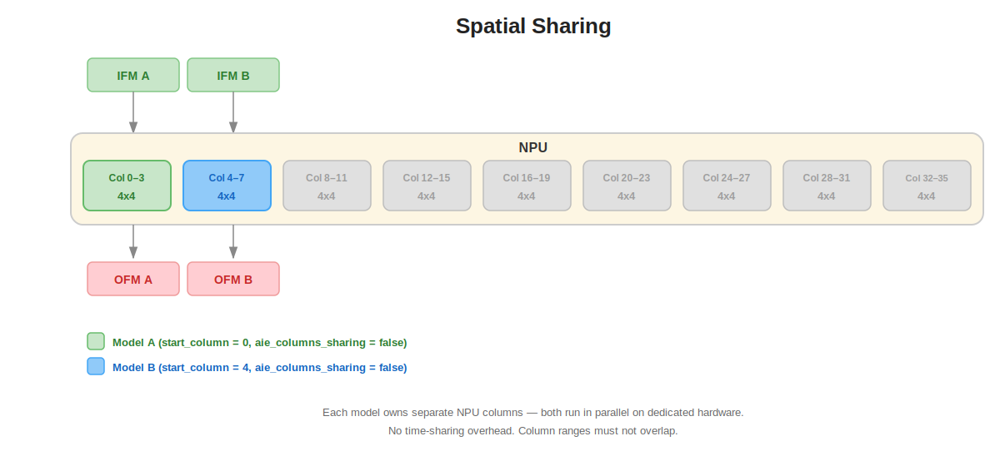
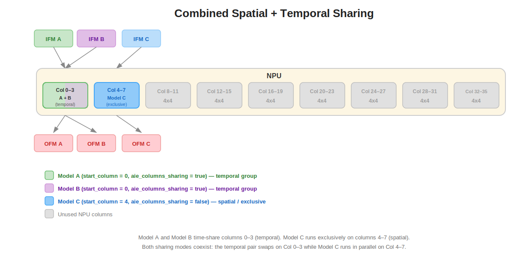

# VART Multi-Model Sequential Application

<!--
## Copyright and license statement

Copyright (C) 2026 Advanced Micro Devices, Inc.

Licensed under the Apache License, Version 2.0 (the "License"); you may not use this file except in compliance with the License. You may obtain a copy of the License at
[http://www.apache.org/licenses/LICENSE-2.0](http://www.apache.org/licenses/LICENSE-2.0).

Unless required by applicable law or agreed to in writing, software distributed under the License is distributed on an "AS IS" BASIS, WITHOUT WARRANTIES OR CONDITIONS OF ANY KIND, either express or implied. See the License for the specific language governing permissions and limitations under the License.
-->

Note: Example model names, JSON files, and commands are for reference only. Modify them for your compiled models and board.

The VART Multi-model Sequential Application is a generic, multi-model
inference runner built on the AMD VART (Vitis AI Runtime) framework for
Versal AI Edge Series Gen 2 devices. It reads a JSON configuration file
describing one or more Vitis AI-compiled models and executes them **sequentially in a
single thread**, looping `N` iterations over the full model sequence.

---

## Key Features

- **Sequential Multi-Model Inference**: Execute multiple Vitis AI-compiled models
  one after another in a single thread, looping `N` iterations over the full
  model sequence.
- **Three Column Placement Policies**: Spatial (exclusive columns per model),
  temporal (time-multiplexed on shared columns), or combined spatial + temporal
  in a single deployment.
- **Batched Model Support**: Handles single-frame and multi-frame IFM files with
  automatic partial-batch detection and warnings.
- **Dry-Run Mode**: Run inference without real input data — IFM buffers are
  filled with random bytes, IFM files are not read from disk, and OFM results
  are not written. This allows quick validation of the JSON configuration and
  NPU column placement, as well as latency benchmarking without requiring
  actual model input binaries.
- **Configurable Verbosity**: Adjustable logging levels (0=errors, 1=+warnings,
  2=+info) for development and debugging.
- **Column Conflict Detection**: Validates NPU column assignments across all
  models before inference and aborts with diagnostics on conflicts.

## Usage

```
vart_multimodel_seq -c <config json file> [options]
```

### Arguments

| Option              | Required  | Default | Description                                                  |
| ------------------- | --------- | ------- | ------------------------------------------------------------ |
| `-c, --config`      | Mandatory |         | Path to the JSON configuration file                          |
| `-r, --runs`        | Optional  | `1`     | Number of iterations over the full model sequence            |
| `-b, --benchmark`   | Optional  | off     | Enable benchmark mode for repeat-run latency/performance measurement |
| `-d, --dry-run`     | Optional  | off     | Dry-run: fill IFMs with random bytes; skip reading IFM / writing OFM |
| `-l, --log-level`   | Optional  | `2`     | Log level (0=errors, 1=+warnings, 2=+info)                   |
| `-h, --help`        | Optional  |         | Print help and exit                                          |

### Input

Each model requires one or more IFM (Input Feature Map) binary files, specified
via the `ifm_node_file_map` field in the JSON configuration. Each IFM file must
contain data for at least one complete frame — a "frame" is one full input tensor
worth of data (e.g. for a model expecting a `1×3×224×224` bf16 input, one frame =
`1×3×224×224×2` bytes).

For models compiled with a batch size greater than 1, IFM files may contain
multiple frames concatenated end-to-end:

- **Partial batch (fewer frames than batch size):** Only the available frames
  are loaded and a `[WARN]` is logged. Inference executes with the partial batch.
- **More frames than batch size:** Only the first `batch_size` frames are
  loaded. The remaining frames are ignored and a `[WARN]` is logged.

> **Note 1:** When multiple iterations are specified (`-r N`), the same input
> frame(s) are reused for each iteration. This application is intended for
> demonstration purposes; multiple iterations are designed for performance
> benchmarking rather than for processing different inputs.

> **Note 2:** Each model input tensor must be mapped to an IFM file in the JSON
> config using `ifm_node_file_map`, where the key is the model's input node name.
> If unsure of node names, provide any name—the application will validate during
> initialization and print a diagnostic table for each model showing:
>
> - **Configured IFM Nodes:** The node names from your JSON config
> - **Expected Input Nodes:** The actual model input node names with data types and shapes
>
> The diagnostic is saved to `ifm_node_data.txt` in the current directory
> for easy reference when correcting the mapping.

### Output

OFM (Output Feature Map) results are written as one binary file per OFM tensor
node (`<node_name>_<shape>_<datatype>.bin`). Each model's outputs are stored in a
dedicated subdirectory within `ofm_dir`, named `ofm_model_1/`, `ofm_model_2/`,
etc. (numbered by their order in the JSON config, starting from 1). When
`batch_size > 1`, all batch frames are concatenated into the same file per OFM
node. If `ofm_dir` is not specified in the JSON config, it defaults to the
current working directory (`"./"`). Only the results from the last iteration
are saved. Skipped when `--dry-run` is set.

## Build

1. Source the Vitis AI SDK for Versal AI Edge Series Gen 2 environment:

```bash
source /path/to/sdk/environment-setup-cortexa72-cortexa53-amd-linux
```

2. Build the application:

```bash
make all
```

The resulting binary is `vart_multimodel_seq`.

3. To clean build artifacts:

```bash
make clean
```

## Running on the Board

### Prerequisites

Before running the commands below, finish board setup for your platform, program the required PL and AI Engine overlay on the board, and configure the runtime environment for your image (including `LD_LIBRARY_PATH`).

1. Set up the board environment:

```bash
export LD_LIBRARY_PATH=/usr/lib/python3.12/site-packages/voe/lib:/usr/lib/python3.12/site-packages/flexmlrt/lib:/usr/lib/python3.12/site-packages/onnxruntime/capi
```

2. The following pre-built configuration is available on the board and can be
   run directly:

```bash
vart_multimodel_seq -c /etc/vai/vart_multimodel_seq/json_configs/config.json
```

3. To run multiple iterations over the model sequence (each iteration cycles
   through all models once):

```bash
vart_multimodel_seq -c /etc/vai/vart_multimodel_seq/json_configs/config.json -r 100
```

4. To run benchmark mode explicitly:

```bash
vart_multimodel_seq -c /etc/vai/vart_multimodel_seq/json_configs/config.json -r 100 -b
```

5. To run a quick dry-run with random IFM data (no IFM/OFM file I/O — useful
   for latency benchmarking when binaries aren't available):

```bash
vart_multimodel_seq -c /etc/vai/vart_multimodel_seq/json_configs/config.json -r 100 -d
```

6. To run with a custom compiled model, copy or mount the working directory on
   the target board. Ensure the compiled model caches and IFM binaries are
   available at the paths specified in the JSON config.

```bash
vart_multimodel_seq -c config.json
```

7. To see help and available options:

```bash
vart_multimodel_seq -h
```

## Configuration JSON Guide

For details about the JSON configuration schema, please refer to [json_configs/README.md](json_configs/README.md).

---

## How `start_column` and `aie_columns_sharing` are Configured

The `start_column` and `aie_columns_sharing` options are read from the JSON
configuration file and passed to the `vart::Runner` as shown in the code snippet
below:

```cpp
std::unordered_map<std::string, std::any> options = {
    {"input_tensor_type",
     std::string(m_input_tensor_type == vart::TensorType::CPU ? "CPU" : "HW")},
    {"output_tensor_type",
     std::string(m_output_tensor_type == vart::TensorType::CPU ? "CPU" : "HW")},
};

// Pass start_column to the runner
if (cfg.is_start_column_provided) {
  options["start_column"] = cfg.start_column;
}
// Pass aie_columns_sharing to the runner
if (cfg.is_columns_sharing_provided) {
  options["aie_columns_sharing"] = cfg.aie_columns_sharing;
}

m_runner = vart::RunnerFactory::create_runner(
    vart::RunnerType::VAIML, m_model_cache_dir, options);
```

Key points:

- **`start_column`** — `uint32_t`. Selects the
  first NPU column the model is placed on.
- **`aie_columns_sharing`** — `bool`. `true` = shared/temporal (column block
  is time-multiplexed with other models that target the same columns);
  `false` = exclusive/spatial (column block is owned by this model only).
- **Conflict detection** — `utils::load_config()` cross-checks all model
  entries: if any two models have overlapping column ranges and at least one
  sets `aie_columns_sharing=false`, the application aborts with a
  diagnostic before any runner is created.


## NPU Column Sharing Modes

The NPU on Versal AI Edge Series Gen 2 has 36 columns. The number of columns a model
occupies is determined by the overlay size used during compilation. Overlay size
can be configured by setting `tp_size` and `dp_size`. For more information
please refer to [multi_tenancy.md](../../docs/multi_tenancy.md).

### Single Model

A single model uses all the NPU columns determined by the overlay size used
during compilation. No column or sharing configuration is needed.

```json
[
  {
    "model_cache_path": "/opt/models/model_a/cache",
    "ifm_node_file_map": { "input_node": "/data/model_a/inputs/input.bin" },
    "ofm_dir": "/data/model_a/outputs"
  }
]
```

### Temporal Sharing

In temporal sharing, multiple models are mapped to the **same** set of NPU
columns. The NPU time-multiplexes between them so that only one model executes
on those columns at any given moment. This is configured by setting
`start_column` to the **same** value and `aie_columns_sharing` to **`"true"`**
for every model.

Temporal sharing is the natural fit for this sequential application — models
already run one after another in a loop, so they can efficiently take turns on
the same physical columns without wasting hardware on idle column reservations.

The diagram below illustrates temporal sharing. During **time slot t1**,
Model A occupies columns 0–3 (shown in green) while all other columns remain
idle (grey). When Model A finishes, the NPU swaps to **time slot t2** and
Model B takes over the **same** columns 0–3 (shown in purple). The dashed
line between the two time slots highlights that both models target identical
columns.

<p align="center">
  
</p>

Key settings (highlighted):

- **`start_column`** — must be **identical** across all models that share the
  block (e.g. all set to `0` to share columns 0–3).
- **`aie_columns_sharing`** — must be **`"true"`** on every sharing model.

```json
[
  {
    "model_cache_path": "/opt/models/model_a/cache",
    "start_column": 0,
    "aie_columns_sharing": "true",
    "ifm_node_file_map": { "input_node": "/data/model_a/inputs/input.bin" },
    "ofm_dir": "/data/model_a/outputs"
  },
  {
    "model_cache_path": "/opt/models/model_b/cache",
    "start_column": 0,
    "aie_columns_sharing": "true",
    "ifm_node_file_map": { "input_node": "/data/model_b/inputs/input.bin" },
    "ofm_dir": "/data/model_b/outputs"
  }
]
```

### Spatial Sharing

In spatial sharing, each model is assigned its **own separate** set of NPU
columns. Because the column ranges do not overlap, each model has dedicated
hardware with no context-switch overhead. This is configured by giving each
model a **different** `start_column` value and setting `aie_columns_sharing`
to **`"false"`**.

In this sequential application, models still execute one after another (single
thread by design), but each model runs on its own dedicated column block —
there is no partition-swap on iteration boundaries.

Spatial sharing requires that the combined column footprint of all models fits
within the 36 available NPU columns. You can compile the model with a reduced
column footprint (e.g. 1x4x4) by setting `dp_size = 1` and `tp_size = 1` in the
`vitisai_config.json` file.

The diagram below illustrates spatial sharing. Model A occupies columns 0–3
(green) while Model B occupies columns 4–7 (blue). The remaining columns
(8–35) are unused and shown in grey. Each model runs on its own dedicated
column slice.

<p align="center">
  
</p>

Each model owns a **separate** set of NPU columns with
`aie_columns_sharing = "false"`. Models still execute sequentially in this app
(single thread by design) but on dedicated column blocks.

> **Note 1:** When running models in spatial mode, ensure that there is
> enough column space available for all models. You can compile the model
> with a reduced column footprint (e.g. 1x4x4) by setting `dp_size = 1` and
> `tp_size = 1` in the `vitisai_config.json` file.
>
> Example `vitisai_config.json` for a **1x4x4** overlay:
>
> ```json
> {
>   "passes": [
>     {
>       "name": "init",
>       "plugin": "vaip-pass_init"
>     },
>     {
>       "name": "vaiml_partition",
>       "plugin": "vaip-pass_vaiml_partition",
>       "vaiml_config": {
>         "keep_outputs": true,
>         "device": "ve2-xc2ve3858",
>         "logging_level": "info",
>         "dp_size": 1,
>         "tp_size": 1
>       }
>     }
>   ],
>   "target": "VAIML",
>   "targets": [
>     {
>       "name": "VAIML",
>       "pass": [
>         "init",
>         "vaiml_partition"
>       ]
>     }
>   ]
> }
> ```

Key settings (highlighted):

- **`start_column`** — must be **distinct** per model and aligned to the
  4-column overlay (e.g. `0`, `4`, `8`, ...). Two models must not map to
  overlapping column ranges.
- **`aie_columns_sharing`** — set to **`"false"`** for exclusive column
  reservation (no swapping with other models).

> **Note 2:** `aie_columns_sharing` does not need to be `false` for spatial
> sharing. Models can still be spatially shared by controlling `start_column`
> alone. Setting `aie_columns_sharing` to `false` exclusively reserves those
> columns for that model, preventing any swapping or time-multiplexing on
> those columns.

```json
[
  {
    "model_cache_path": "/opt/models/model_a/cache",
    "start_column": 0,
    "aie_columns_sharing": "false",
    "ifm_node_file_map": { "input_node": "/data/model_a/inputs/input.bin" },
    "ofm_dir": "/data/model_a/outputs"
  },
  {
    "model_cache_path": "/opt/models/model_b/cache",
    "start_column": 4,
    "aie_columns_sharing": "false",
    "ifm_node_file_map": { "input_node": "/data/model_b/inputs/input.bin" },
    "ofm_dir": "/data/model_b/outputs"
  }
]
```

### Combined Spatial + Temporal

Temporal and spatial sharing can coexist in a single deployment. A subset of
models is configured to time-multiplex on a shared column range (temporal),
while one or more other models are each assigned their own exclusive column
range (spatial). In the example below, Model_1 and Model_2 share columns 0–3
with `aie_columns_sharing = true`, while Model_3 exclusively owns columns 4–7
with `aie_columns_sharing = false`.

The diagram below illustrates the combined mode. Columns 0–3 are shared
temporally by Model A (green) and Model B (purple) — they take turns on the
same hardware. Columns 4–7 are exclusively owned by Model C (blue), which
runs in parallel on dedicated hardware. The remaining columns are unused
(grey).

<p align="center">
  
</p>

Key settings (highlighted):

- **`start_column`** — use the **same** value across all models in a temporal
  group, and a **different**, non-overlapping value for each spatial model.
- **`aie_columns_sharing`** — set to **`"true"`** for every model in a temporal
  group, and **`"false"`** for spatial (exclusive) models.

```json
[
  {
    "model_cache_path": "/opt/models/model_a/cache",
    "start_column": 0,
    "aie_columns_sharing": "true",
    "ifm_node_file_map": { "input_node": "/data/model_a/inputs/input.bin" },
    "ofm_dir": "/data/model_a/outputs"
  },
  {
    "model_cache_path": "/opt/models/model_b/cache",
    "start_column": 0,
    "aie_columns_sharing": "true",
    "ifm_node_file_map": { "input_node": "/data/model_b/inputs/input.bin" },
    "ofm_dir": "/data/model_b/outputs"
  },
  {
    "model_cache_path": "/opt/models/model_c/cache",
    "start_column": 4,
    "aie_columns_sharing": "false",
    "ifm_node_file_map": { "input_node": "/data/model_c/inputs/input.bin" },
    "ofm_dir": "/data/model_c/outputs"
  }
]
```

```
Column layout:  Column 0 : Model_1, Model_2 (shared / temporal)
                Column 4 : Model_3 (exclusive / spatial)
```


### Verifying AI Engine Column Allocation

During inference execution you can cross-check which AI Engine columns each model was
assigned to by using the `xrt-smi` command on the board:

```
xrt-smi examine --device 0 --report aie-partitions
```

> **Note:** You must run `xrt-smi examine` **during** inference execution.
> If the command is executed after inference completes, the partitions will
> have been released and no report will be shown. Open a second terminal on
> the board and run the command while inference is in progress.

#### Temporal sharing

Both models share the **same** partition (same column set). Two HW Contexts
appear under a single Partition Index because both models time-multiplex on
columns 0–3:

```
AIE Partitions
  Total Memory Usage: N/A
  Partition Index   : 0
    Columns: [0, 1, 2, 3]
    HW Contexts:
      |PID                 |Ctx ID     |Submissions |Migrations  |Err  |Priority |
      |Process Name        |Status     |Completions |Suspensions |     |GOPS     |
      |Memory Usage        |Instr BO   |            |            |     |FPS      |
      |                    |           |            |            |     |Latency  |
      |====================|===========|============|============|=====|=========|
      |1196                |1          |98          |0           |0    |Normal   |
      |N/A                 |Idle       |97          |0           |     |1        |
      |66 MB               |N/A        |            |            |     |1        |
      |                    |           |            |            |     |2000     |
      |--------------------|-----------|------------|------------|-----|---------|
      |1196                |2          |120         |0           |0    |Normal   |
      |N/A                 |Idle       |119         |0           |     |1        |
      |66 MB               |N/A        |            |            |     |1        |
      |                    |           |            |            |     |2000     |
      |--------------------|-----------|------------|------------|-----|---------|
```

#### Spatial sharing

Each model appears under its **own** Partition Index with a disjoint column
set. The two partitions run in parallel on separate hardware.

```
AIE Partitions
  Total Memory Usage: N/A
  Partition Index   : 0
    Columns: [0, 1, 2, 3]
    HW Contexts:
      |PID                 |Ctx ID     |Submissions |Migrations  |Err  |Priority |
      |Process Name        |Status     |Completions |Suspensions |     |GOPS     |
      |Memory Usage        |Instr BO   |            |            |     |FPS      |
      |                    |           |            |            |     |Latency  |
      |====================|===========|============|============|=====|=========|
      |1179                |1          |870         |0           |0    |Realtime |
      |N/A                 |Idle       |869         |0           |     |1        |
      |66 MB               |N/A        |            |            |     |1        |
      |                    |           |            |            |     |2000     |
      |--------------------|-----------|------------|------------|-----|---------|
  Partition Index   : 1
    Columns: [4, 5, 6, 7]
    HW Contexts:
      |PID                 |Ctx ID     |Submissions |Migrations  |Err  |Priority |
      |Process Name        |Status     |Completions |Suspensions |     |GOPS     |
      |Memory Usage        |Instr BO   |            |            |     |FPS      |
      |                    |           |            |            |     |Latency  |
      |====================|===========|============|============|=====|=========|
      |1179                |2          |1000        |0           |0    |Realtime |
      |N/A                 |Active     |1000        |0           |     |1        |
      |66 MB               |N/A        |            |            |     |1        |
      |                    |           |            |            |     |2000     |
```

#### Combined spatial + temporal sharing

The output shows **two** partitions. Partition 0 (columns 0–3) has two HW
Contexts sharing the same columns temporally, while Partition 1 (columns 4–7)
has a single HW Context running exclusively.

```
AIE Partitions
  Total Memory Usage: N/A
  Partition Index   : 0
    Columns: [0, 1, 2, 3]
    HW Contexts:
      |PID                 |Ctx ID     |Submissions |Migrations  |Err  |Priority |
      |Process Name        |Status     |Completions |Suspensions |     |GOPS     |
      |Memory Usage        |Instr BO   |            |            |     |FPS      |
      |                    |           |            |            |     |Latency  |
      |====================|===========|============|============|=====|=========|
      |1213                |1          |39          |0           |0    |Normal   |
      |N/A                 |Idle       |38          |0           |     |1        |
      |106 MB              |N/A        |            |            |     |1        |
      |                    |           |            |            |     |2000     |
      |--------------------|-----------|------------|------------|-----|---------|
      |1213                |2          |40          |0           |0    |Normal   |
      |N/A                 |Idle       |39          |0           |     |1        |
      |106 MB              |N/A        |            |            |     |1        |
      |                    |           |            |            |     |2000     |
      |--------------------|-----------|------------|------------|-----|---------|
  Partition Index   : 1
    Columns: [4, 5, 6, 7]
    HW Contexts:
      |PID                 |Ctx ID     |Submissions |Migrations  |Err  |Priority |
      |Process Name        |Status     |Completions |Suspensions |     |GOPS     |
      |Memory Usage        |Instr BO   |            |            |     |FPS      |
      |                    |           |            |            |     |Latency  |
      |====================|===========|============|============|=====|=========|
      |1213                |3          |46          |0           |0    |Realtime |
      |N/A                 |Idle       |45          |0           |     |1        |
      |106 MB              |N/A        |            |            |     |1        |
      |                    |           |            |            |     |2000     |
      |--------------------|-----------|------------|------------|-----|---------|
```


## Application Flow

```
  +--------------+     +------------+     +-----------+     +-----------+
  | Parse Config |---->| Initialize |---->| Validate  |---->| Allocate  |
  | (JSON + CLI) |     | Runners    |     | IFM Names |     | Tensors   |
  +--------------+     +------------+     | & Sizes   |     | (per-mdl) |
                                          +-----------+     +-----------+
                                                                  |
                                                                  v
                                                            +----------+
                                                            |  Load    |
                                                            |  IFMs    |
                                                            | (per-mdl)|
                                                            +----------+
                                                                  |
                                                                  v
                                                            +-----------+
                                                            | Single    |
                                                            | Thread    |
                                                            |-----------|
                                                        +-->| Model_0   |
                                                        |   | Model_1   |
                                                  xN    |   |  ...      |
                                                  iter  |   | Model_n   |
                                                        |   +-----+-----+
                                                        |         |
                                                        +---------+
                                                                  |
                                                                  v
                                         +-----------+     +-----------+
                                         |   exit    |<----| Save OFMs |
                                         +-----------+     | (per-mdl) |
                                                           +-----------+
```

The application runs in four phases, all in a single thread:

**Phase 1 — Initialise & Validate** (`init_and_validate_models`):
1. Parse CLI arguments and load the JSON config.
2. Validate NPU column assignments and sharing constraints.
3. For each model: create the VART runner, fetch tensor metadata.
4. Validate IFM node names and file sizes across all models
   (skipped when `--dry-run` is set).

**Phase 2 — Allocate & Load IFMs** (per-model, once):
1. Allocate IFM and OFM `NpuTensor` buffers — one set per batch slot, where
   the batch size is queried from `m_runner->get_batch_size()`.
2. Load IFM binary files into the input tensors. A single IFM file may
   contain `1..batch_size` consecutive frames; if it contains fewer than
   `batch_size` the remaining slots are left at zero and a `[WARN]` is
   emitted. Inference still executes with the available frames.
3. When `--dry-run` is set, IFM tensors are filled with random bytes
   instead of reading files.

**Phase 3 — Sequential Inference** (single thread):
```
for iter in 0..iterations:
    for model in models:
        infer(model)        # accumulate per-model latency
```
**Phase 4 — Save & Report**:
1. Save the OFMs of each model once (results from the last iteration).
   OFM results are written as one binary file per OFM tensor node
   (`<node_name>_<shape>_<datatype>.bin`). Each model's outputs are stored in a
   dedicated subdirectory within `ofm_dir`, named `ofm_model_1/`, `ofm_model_2/`,
   etc. (numbered by their order in the JSON config, starting from 1). This
   prevents OFM files from being overwritten when the same model appears multiple
   times in the config. When `batch_size > 1`, all batch frames are concatenated
   into the same file per OFM node. Skipped when `--dry-run` is set.
2. Print an Execution Summary table showing per-model AI Engine column placement
  and OFM-save status.
3. Print a separate Performance table showing per-model iteration count and
  average latency.


## Sample Output

```
========== Execution Summary ==========
------------+---------+------------------------------------------------------------------------
Start Column | Model   | OFMs file saved
------------+---------+------------------------------------------------------------------------
0 (shared)   | Model_1 | /data/model_a/outputs/ofm_model_1/output_QuantizeLinear_Output_1x1000_int8.bin
0 (shared)   | Model_2 | /data/model_b/outputs/ofm_model_2/output_QuantizeLinear_Output_1x1000_int8.bin
------------+---------+------------------------------------------------------------------------
```


## Differences vs `vart_multi_tenancy`

| Aspect            | vart_multi_tenancy                         | vart_multimodel_seq                       |
| ----------------- | ------------------------------------------ | ----------------------------------------- |
| Threading         | One thread per model (parallel)            | Single thread, sequential                 |
| Iteration loop    | Outer model thread, inner iterations       | Outer iterations, inner models            |
| Use case          | Spatial / temporal sharing benchmarking    | Sequential multi-model inference          |
| Timing report     | Per-thread summary                         | Separate execution and performance tables |
