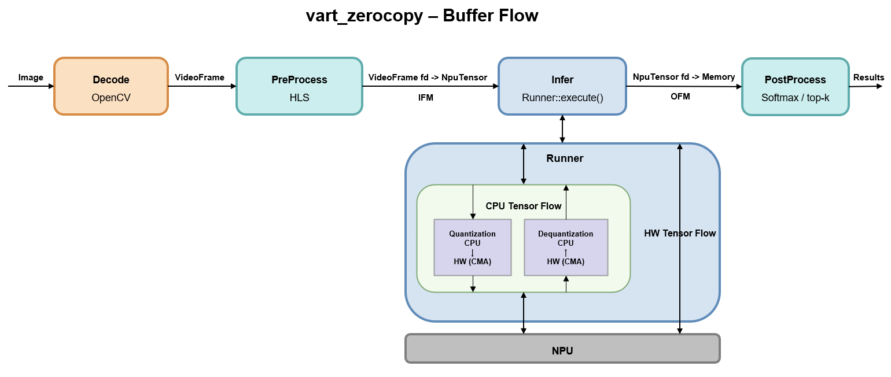

# VART Zero-Copy Application

<!--
## Copyright and license statement

Copyright (C) 2025-2026 Advanced Micro Devices, Inc.

Licensed under the Apache License, Version 2.0 (the "License"); you may not use this file except in compliance with the License. You may obtain a copy of the License at
[http://www.apache.org/licenses/LICENSE-2.0](http://www.apache.org/licenses/LICENSE-2.0).

Unless required by applicable law or agreed to in writing, software distributed under the License is distributed on an "AS IS" BASIS, WITHOUT WARRANTIES OR CONDITIONS OF ANY KIND, either express or implied. See the License for the specific language governing permissions and limitations under the License.
-->


Note: Example model names, JSON files, and commands are for reference only. Modify them for your compiled models and board.

`vart_zerocopy` is a C++ sample application based on ``VART-X`` and ``VART-ML`` that demonstrates zero-copy and non-zero-copy flows across the complete end-to-end pipeline: preprocess -> inference -> postprocess.

Under the hood it is a VART-X preprocess + `vart::Runner` inference + VART-X postprocess pipeline that can run in two tensor-binding flavours: zero-copy (HW tensor type, default) and non-zero-copy (CPU tensor type, `-c` / `--non-zero-copy`). Each run prints a per-frame benchmark block so the two flows can be compared by invoking the binary twice. Defaults are ImageNet-style ResNet-50 classification; retarget for other models by editing the in-source `pipeline_cfg` and preprocess/postprocess setup.

**Operating modes:**

- **Zero-copy mode (default)** — `vart::Runner` is configured with **HW tensor type** for both IFM and OFM. Preprocess produces the IFM directly in the NPU's HW layout and `Runner::execute()` consumes it as-is. This is the recommended fast path.
- **Non-zero-copy mode (`-c` / `--non-zero-copy`)** — `vart::Runner` is configured with **CPU tensor type** for both IFM and OFM. Preprocess produces a planar float CPU IFM and `Runner::execute()` performs an extra HW<->CPU translation internally. Provided so the two flows can be compared side by side.

In both modes the IFM and OFM device buffers are shared end-to-end via dma-buf, so the application never stages an extra copy between preprocess to runner and runner to postprocess. See [Tensor-type modes](#tensor-type-modes) for the per-mode mechanics, [Buffer flow](#buffer-flow) for the IFM/OFM wiring, and [Comparing zero-copy vs non-zero-copy](#comparing-zero-copy-vs-non-zero-copy) for the suggested back-to-back commands.

## Key Features

- **Two tensor-binding modes in one binary** — default zero-copy (HW tensor type) and `-c` / `--non-zero-copy` (CPU tensor type); see [Tensor-type modes](#tensor-type-modes).
- **Zero-copy IFM bridge** — preprocess output is bound to the runner via `NpuTensor(meta, &fd, DMA_FD)` (same physical buffer as preprocess output) in both modes.
- **Zero-copy OFM bridge** — the runner-allocated OFM `NpuTensor` is exported as a dma-buf fd and imported as `vart::Memory(MemoryImplType::XRT, fd, size, device)`, which is then passed straight to `PostProcess::process(vector<vector<shared_ptr<vart::Memory>>>, batch)` — no staging OFM copy in either mode.
- **Built-in per-frame benchmark** — `-n / --runs N` prints per-stage averages and the `throughput (infer)` / `throughput (pipeline)` FPS lines on stdout; see [Comparing zero-copy vs non-zero-copy](#comparing-zero-copy-vs-non-zero-copy) for more info.
- **Single-threaded, sequential pipeline** — decode, preprocess, `Runner::execute`, postprocess and display all run on the same thread with no overlap, so benchmark stage averages are wall-clock latencies of each call in isolation.
- **Frame reused across iterations** — one JPEG is loaded and uploaded once per invocation; with `-n / --runs N` the timed loop reuses the same already-bound IFM/OFM buffers, so each iteration only re-runs `preprocess` → `infer` → `postprocess` on that frame.
- **ImageNet-style classification defaults** — ships configured for ResNet-50 (ImageNet mean/scale preprocess, softmax + top-K labels postprocess); retarget for other models via the [Hardcoded Configuration](#hardcoded-configuration-change-here-for-your-model) table.

## Usage

```bash
vart_zerocopy -i <image.jpg> -m <model_path> [-c | --non-zero-copy] [-n <N> | --runs <N>]
```

### Arguments

| Option              | Required  | Default | Description                                                  |
| ------------------- | --------- | ------- | ------------------------------------------------------------ |
| `-h / --help`       | Optional  |         | Print help message.                                          |
| `-i / --image`      | Mandatory |         | Input image path (jpg file) (required).                      |
| `-m / --model-dir`  | Mandatory |         | Compiled model: path to a `.rai` file, or a directory containing one `.rai`, or a directory containing `vaiml_par_0` (required). |
| `-c / --non-zero-copy` | Optional | off | Switch the runner to CPU tensor type. See [Tensor-type modes](#tensor-type-modes) for the per-mode preprocess `VideoFormat`, `scale_coeff` policy, and CPU IFM dtype restriction. |
| `-n / --runs`       | Optional  | `1`     | Number of timed benchmark iterations on the same image (must be `>= 1`). A fixed 1-iteration warmup (the preprocess + infer + postprocess sequence, i.e. steps 3-5 of [Application Flow](#application-flow)) is always done before the timed loop. |

`-m/--model-dir` accepts:

- path to a `.rai` file, or
- a directory containing one `.rai`, or
- a directory containing `vaiml_par_0`.

### Input

- Image path (`-i` / `--image`; jpg file).
- Compiled model path (`-m` / `--model-dir`; as described under [Arguments](#arguments)).
- On target, the application expects the preprocess xclbin at `/run/media/mmcblk0p1/x_plus_ml.xclbin` and the default ResNet-50 label file at `/etc/vai/models/resnet50_int8/data/imagenet-classes-1000.txt`. Both paths are hardcoded in the binary; change them via the [Hardcoded Configuration](#hardcoded-configuration-change-here-for-your-model) table if your layout differs.

### Output

- Top-K labels printed to the console once per run (see [Application Flow](#application-flow) step 5).
- When `-n / --runs N` is set, an additional benchmark block is printed at the end with per-stage averages (`preprocess`, `infer`, `postprocess`, `total`) and `throughput (infer)` / `throughput (pipeline)` in FPS; see [Comparing zero-copy vs non-zero-copy](#comparing-zero-copy-vs-non-zero-copy) for how to read it.

## Build

1. Source the Vitis AI SDK for Versal AI Edge Series Gen 2 environment:

```bash
source /path/to/sdk/environment-setup-cortexa72-cortexa53-amd-linux
```

2. Build the application:

```bash
make all
```

The resulting binary is `vart_zerocopy`.

3. To clean build artifacts:

```bash
make clean
```

## Running on the Board

After [Build](#build) above, copy the `vart_zerocopy` binary to the target. Ensure the paths the binary expects are valid on the board: the preprocess xclbin and the label file at the locations listed in [Input](#input), a compiled model at the path passed via `-m / --model-dir`, and a JPEG at the path passed via `-i / --image`.

To run a different model, update the [Hardcoded Configuration](#hardcoded-configuration-change-here-for-your-model) entries that don't match your target (xclbin path, device index, batch, preprocess constants, label/topk fields, postprocess type).

### Prerequisites

Before running the commands below, finish board setup for your platform, program the required PL and AI Engine overlay on the board, and configure the runtime environment for your image (including `LD_LIBRARY_PATH`).

### Example commands

- **Run one JPEG through the pipeline:**

  *Syntax:*
  ```bash
  vart_zerocopy -i <image.jpg> -m <model_path>
  ```

  *Example:*
  ```bash
  vart_zerocopy -i /etc/vai/models/resnet50_int8/data/classification.jpg -m /etc/vai/models/resnet50_int8
  ```

- **Print CLI options:**
  ```bash
  vart_zerocopy -h
  ```

- **Benchmark the zero-copy (HW tensor type) path:**
  ```bash
  vart_zerocopy -i /etc/vai/models/resnet50_int8/data/classification.jpg -m /etc/vai/models/resnet50_int8 -n 100
  ```

- **Benchmark the non-zero-copy (CPU tensor type) path on the same image:**
  ```bash
  vart_zerocopy -i /etc/vai/models/resnet50_int8/data/classification.jpg -m /etc/vai/models/resnet50_int8 -n 100 -c
  ```

See [Comparing zero-copy vs non-zero-copy](#comparing-zero-copy-vs-non-zero-copy) for how to read the benchmark output.

## Application Flow

Runtime phases. All steps run on a single thread, sequentially.

1. **Initialize**
   - parse CLI
   - resolve model path
   - create runner (HW tensor type for zero-copy mode, CPU tensor type when `-c` / `--non-zero-copy` is set), preprocess, and postprocess
2. **Load image**
   - read and decode the JPEG with OpenCV (`cv::imread`, BGR), then stage the pixels into a host-side buffer for upload
3. **Preprocess + IFM bind**
   - copy CPU BGR into the preprocess input `VideoFrame`
   - run **VART-X** preprocess; the output `VideoFormat` is mode-specific (packed RGBx-family in zero-copy mode, planar `RGBP_FP16` / `RGBP_FLOAT` in non-zero-copy mode) so the output buffer is valid IFM memory for the active runner tensor type
   - bind that buffer to the runner input via `NpuTensor(meta, &fd, MemoryType::DMA_FD)` (zero-copy IFM bridge; see [Buffer flow](#buffer-flow))
4. **Inference**
   - run **VART-ML** (`Runner::execute`)
   - `execute()` performs IFM/OFM cache+DMA sync internally; the host can read OFM bytes as soon as it returns (explicit `NpuTensor::sync_buffer()` is only required if the runner is created with `skip_in_bo_sync` / `skip_out_bo_sync`)
   - in non-zero-copy mode the runner additionally performs an HW<->CPU translation inside `execute()`; the NPU job itself is identical between modes
5. **Postprocess + output**
   - call **VART-X** `PostProcess::process(vector<vector<shared_ptr<vart::Memory>>>, batch)` with the shared OFM `vart::Memory` handles imported from each OFM `NpuTensor`'s dma-buf fd; `set_config` must match the graph and the active mode (see [Tensor-type modes](#tensor-type-modes) for the per-mode `scale_coeff` policy)
   - print top label(s) to the console
6. **Benchmark (when `-n / --runs N` is set)**
   - silence per-step logs, run a fixed 1-iteration warmup on the already-bound buffers, then run the timed loop
   - print per-stage averages plus `throughput (infer)` / `throughput (pipeline)`; see [Comparing zero-copy vs non-zero-copy](#comparing-zero-copy-vs-non-zero-copy)

## Tensor-type modes

The pipeline supports two tensor-binding modes selected at startup:

- **Zero-copy (default)** — runner options `input_tensor_type=HW` / `output_tensor_type=HW`. Preprocess writes the HW IFM directly: `INT8` / `UINT8` -> `RGBx`, `BF16` -> `RGBx_BF16`, `FP16` -> `RGBx_FP16`. Any other HW IFM dtype is rejected at startup. Postprocess `scale_coeff` follows the runner's quant scale for INT8/UINT8 IFM/OFM and is `1.0` for float tensors.
- **Non-zero-copy (`-c` / `--non-zero-copy`)** — runner options `input_tensor_type=CPU` / `output_tensor_type=CPU`. Preprocess writes a planar float IFM whose colour-format is picked from the CPU IFM dtype: `FP16 -> RGBP_FP16`, `FLOAT32 -> RGBP_FLOAT`. Any other CPU IFM dtype is rejected at startup. Postprocess uses `scale_coeff=1.0` for both IFM and OFM because the runner returns the CPU tensor already dequantized.

The CPU IFM dtype that the runner exposes is decided by the compiled model. For an INT8-quantized graph the CPU tensor is typically FP32 (already dequantized by the runner), but not all models behave this way. If the CPU IFM dtype is something other than FP16 / FLOAT32, the app errors out at startup with a clear message instead of silently misfeeding the runner.

**Supported input memory layouts.** Regardless of mode, the runner-reported memory layout of the input tensor must be one of `NHW`, `NHWC`, `NCHW`, or `HCWNC4`. Other layouts (`NHWC4`, `NHWC8`, `NC4HW4`, `NC8HW8`, `HCWNC8`, `HCWNC16`, `NHW16C4WC`, `NHW16WC4C`, `GENERIC`, ...) are rejected at startup because the HLS preprocess kernel can't produce IFM bytes in those layouts and the dma-buf IFM bridge would silently misfeed the runner.

> **Note (buffer types used in this sample):** This application uses a `VideoFrame` for the IFM and a `vart::Memory` for the OFM, and bridges both to the runner via dma-buf (`NpuTensor` constructed with `MemoryType::DMA_FD`). Both buffer types are XRT-backed CMA allocations. This choice is driven by the HLS preprocess IP (which produces an XRT-backed `VideoFrame`) and is also the cleanest way to keep the same preprocess → runner → postprocess wiring across both zero-copy and non-zero-copy modes for explanation purposes.
>
> **CMA is not required for the non-zero-copy mode.** In CPU tensor type the runner accepts plain host memory (stack or heap, e.g. `new` / `malloc` / `std::vector`) as well; wrap the buffer with `NpuTensor(meta, host_ptr, MemoryType::USER_POINTER_NON_CMA)` and pass it to `Runner::execute()`. The runner does the same internal CPU<->HW translation either way. What changes is only where the runner reads the input bytes from (a CMA buffer in the dma-buf case, a plain host buffer in the `USER_POINTER_NON_CMA` case).

## Hardcoded Configuration (change here for your model)

Configuration is kept in source. If your platform/model differs, update the following:

| Area | Location | Current value | Change when |
|------|----------|---------------|-------------|
| Xclbin path | `pipeline_cfg::kXclbinPath` in `vart_zerocopy.cpp` | `/run/media/mmcblk0p1/x_plus_ml.xclbin` | preprocess xclbin is at a different path |
| Device index | `pipeline_cfg::kDeviceIndex` in `vart_zerocopy.cpp` | `1` | XRT device index differs on target |
| Preprocess backend | `pipeline_cfg::kPreprocessHls` in `vart_zerocopy.cpp` | `true` | use software preprocess (`false`) instead of HLS (`true`) |
| Preprocess mem banks | `pipeline_cfg::kPreprocessInputMemBank`, `pipeline_cfg::kPreprocessOutputMemBank` in `vart_zerocopy.cpp` | `2`, `2` | platform memory-bank mapping differs |
| App batch size | `pipeline_cfg::kBatchSize` in `vart_zerocopy.cpp` | `1` | model batch size is not 1 |
| Preprocess constants | `resnet50_preprocess_info` in `vart_zerocopy.cpp` | ImageNet mean/scale + PANSCAN defaults | model requires different normalization or resize policy |
| Postprocess fields | `make_inline_postprocess_json()` in `vart_zerocopy.cpp` | `topk`, `label-file-path`, `post-process-print`, `quant-scale-factors` | labels/topk/scale behavior differs |
| Postprocess type | `setup_postprocess_()` in `vart_zerocopy.cpp` | `vart::PostProcessType::SOFTMAX` | model needs a different postprocess type |

## Buffer flow

<p align="center">
  
</p>

The app-side IFM (preprocess → runner) and OFM (runner → postprocess) bridges use the same dma-buf wiring in both modes. The 6 steps below describe that shared flow; the [What changes in non-zero-copy mode](#what-changes-in-non-zero-copy-mode) subsection that follows lists the per-mode deltas (preprocess `VideoFormat`, runner-internal translation inside `execute()`, postprocess `scale_coeff`).

### End-to-end flow (both modes)

1. **Decode on the host** (OpenCV), then **upload** into the preprocess-input `VideoFrame` (a normal host→device copy).
2. **Run preprocess** so the output `VideoFrame` carries the IFM in the active mode's colour-format. A runtime check rejects any mismatch between the preprocess output byte size and the runner IFM byte size.
3. **Bind IFM:** export a dma-buf fd from the preprocess output `VideoFrame` and construct `NpuTensor(ifm_meta, &fd, MemoryType::DMA_FD)` using the active-mode IFM metadata. The runner and preprocess share the same CMA buffer; the app does not stage a second IFM copy.
4. **Allocate OFM via the runner** and bridge it to postprocess by exporting the OFM `NpuTensor`'s fd and importing it as `vart::Memory(MemoryImplType::XRT, fd, size, device)`. The runner writes directly into this shared CMA buffer during `execute()`.
5. **Run inference** with `Runner::execute()`. Cache+DMA sync is handled internally; explicit `NpuTensor::sync_buffer()` is only required if the runner is created with `skip_in_bo_sync` / `skip_out_bo_sync`. What `execute()` does *inside* depends on the active mode — see [What changes in non-zero-copy mode](#what-changes-in-non-zero-copy-mode).
6. **Bind OFM into postprocess:** call `PostProcess::process(vector<vector<shared_ptr<vart::Memory>>>, batch)` with the shared `vart::Memory` handles. Layout, datatype and `scale_coeff` in the `set_config()` call must match the active mode.

### What changes in non-zero-copy mode

The 6-step sequence is identical; only the three points below differ. Full per-mode policy (runner options, accepted CPU IFM dtypes, etc.) is in [Tensor-type modes](#tensor-type-modes).

- **Step 2 — preprocess output `VideoFormat`:**
  - Zero-copy: packed RGBx-family (`RGBx` / `RGBx_BF16` / `RGBx_FP16`) picked from the HW IFM dtype.
  - Non-zero-copy: planar float picked from the CPU IFM dtype: `FP16 -> RGBP_FP16`, `FLOAT32 -> RGBP_FLOAT`.
- **Step 5 — what `execute()` does internally:**
  - Zero-copy: NPU reads the HW IFM and writes the HW OFM in their native HW layouts directly from/to the bound CMA buffers — no layout conversion, no internal staging.
  - Non-zero-copy: runner performs an additional HW<->CPU translation in both directions — reads the CPU-layout IFM to host, converts CPU->HW + quantizes into an internal HW IFM staging buffer, runs the NPU into an internal HW OFM staging buffer, then converts HW->CPU + dequantizes and writes the result into the app's CPU-layout OFM buffer. The translation is hidden inside `execute()` and is not visible to the app.
- **Step 6 — postprocess `scale_coeff`:**
  - Zero-copy: runner's per-tensor quant scale (or `1.0` for float tensors) so the backend can dequantize the HW OFM before softmax/top-k.
  - Non-zero-copy: `1.0` for both IFM and OFM because the runner returns the CPU tensor already dequantized.

See the detailed comment block on `VartZerocopyPipeline::allocate_buffers()` in `vart_zerocopy.cpp` for the same pipeline in code-oriented form.

## Comparing zero-copy vs non-zero-copy

The same binary demonstrates both flows end-to-end. To see the performance gain that zero copy provides, run the two benchmark commands back to back on the same image and compare the `throughput (infer)` line of the printed benchmark block:

```bash
# Zero-copy (default, HW tensor type)
vart_zerocopy -i /etc/vai/models/resnet50_int8/data/classification.jpg -m /etc/vai/models/resnet50_int8 -n 100

# Non-zero-copy (CPU tensor type)
vart_zerocopy -i /etc/vai/models/resnet50_int8/data/classification.jpg -m /etc/vai/models/resnet50_int8 -n 100 -c
```

How to read the output:

- `throughput (infer)` isolates `vart::Runner::execute` and is the line the mode switch actually moves. Zero-copy will report a higher FPS than non-zero-copy because the NPU consumes the HW-layout IFM and produces the HW-layout OFM directly from CMA buffers, with no per-call CPU<->HW translation, and no internal staging inside the runner.
- `throughput (pipeline)` rolls in preprocess and postprocess. Both stages also move slightly between modes (different preprocess `VideoFormat`, different postprocess dequant path) but the dominant delta comes from the infer line.
- The NPU job itself is identical between modes (same compiled graph, same HW IFM bytes consumed, same HW OFM bytes produced). The infer delta is entirely runner-side CPU<->HW conversion and internal staging in non-zero-copy mode.

> **Note:** For `-n / --runs > 1`, the same input frame is reused across iterations. This demo is intended for performance comparison, not for processing different inputs.
