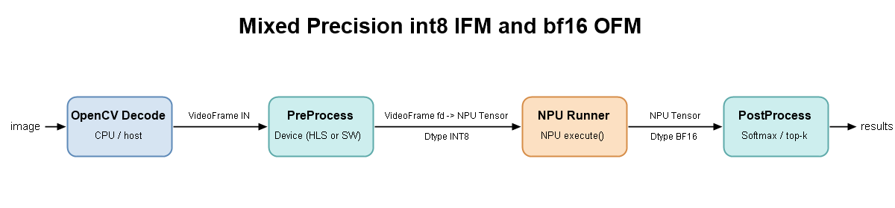
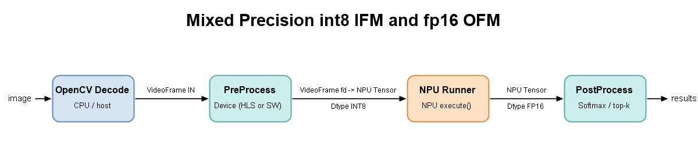

# Compiling and Executing Mixed Precision Models
<!--
## Copyright and license statement

Copyright (C) 2026 Advanced Micro Devices, Inc.

Licensed under the Apache License, Version 2.0 (the "License"); you may not use this file except in compliance with the License. You may obtain a copy of the License at
[http://www.apache.org/licenses/LICENSE-2.0](http://www.apache.org/licenses/LICENSE-2.0).

Unless required by applicable law or agreed to in writing, software distributed under the License is distributed on an "AS IS" BASIS, WITHOUT WARRANTIES OR CONDITIONS OF ANY KIND, either express or implied. See the License for the specific language governing permissions and limitations under the License.
-->

## Introduction

This document describes how to quantize, compile, and execute a mixed precision model (INT8 head, BF16/FP16 tail) using the `x_plus_ml_vart` application on AMD Versal™ AI Edge Series Gen 2 with Vitis AI 6.2.

The workflow is as follows:

1. **Quantization** – The model is quantized using AMD Quark with the VINT8 configuration. During this step, the user specifies a tail subgraph to exclude from INT8 quantization.
2. **Compilation** – The compiler converts the excluded FP32 tail section of the ONNX model to BF16 or FP16, based on user configuration. This ensures the entire model runs on the NPU for optimal performance.
3. **Execution** – Inference is performed through the Vitis AI Execution Provider with VART application on the VEK385 board.

## Prerequisites

The following software and hardware are required:

- **Vitis AI 6.2 Docker for Versal AI Edge Series Gen 2** – for model quantization and compilation
- **Vitis AI SDK for Versal AI Edge Series Gen 2** – with `environment-setup` sourced
- **VEK385 evaluation kit** – or another compatible Versal AI Edge Series Gen 2 target

## Model Quantization and Compilation

### Prepare and Run Docker

Load the Docker image:

```bash
docker load -i <docker_image_file>.tgz
```

Run `docker images` to verify the repository, image ID, and tag information:

| REPOSITORY           | TAG               | IMAGE ID     | CREATED       | SIZE   |
|----------------------|-------------------|--------------|---------------|--------|
| vitis_ai_2ve_docker  | release_v6.x_xxxx |   xxxxxxxx   | xx hours ago  | 39.1GB |

Start the Docker container, then set up the environment and place the model ONNX file inside the container.

### Prepare Calibration Data for Quantization

Prepare calibration and validation datasets for quantization. A larger calibration dataset generally yields better accuracy after quantization.

Once the data is ready, proceed to quantize the model for NPU execution.

### Model Quantization

AMD Quark is used for quantization to optimize performance while preserving accuracy. For details, see the [Quark documentation](https://quark.docs.amd.com/latest/).

#### VINT8 Quantization

- AMD Quark provides default configurations for INT8 quantization. The `VINT8` configuration applies symmetric INT8 activation quantization with a power-of-two scale factor.
- In mixed precision mode, excluding the post-processing subgraph from INT8 quantization yields better accuracy than quantizing the entire model. The following example shows a typical mixed precision quantization configuration:

```python
quant_config = get_default_config("VINT8")
quant_config.extra_options["Int32Bias"] = False
quant_config.enable_npu_cnn = True
quant_config.subgraphs_to_exclude = [([<sub_graph_node1>], [<sub_graph_node2>])]
float_model_path = "models/<model_name>.onnx"
quantized_model_path = "models/<quantized_model_name>.onnx"
calib_data_path = "calib_data"
```

> **⚠️ Important**: For example when quantizing YOLOv8 models, exclude the post-processing subgraph to avoid missed detections. Apply VINT8 quantization only to the main network. See the YOLOv8-specific configuration example below:

```python
quant_config = get_default_config("VINT8")
quant_config.extra_options["Int32Bias"] = False
quant_config.enable_npu_cnn = True
quant_config.subgraphs_to_exclude = [(["/model.22/Concat_3"], ["/model.22/Concat_5"])]
float_model_path = "models/yolov8m.onnx"
quantized_model_path = "models/yolov8m_VINT8_skipNodes.onnx"
calib_data_path = "calib_data"
```

Run the Python-based quantization inside Docker using the `ModelQuantizer` class from Quark. For a detailed description of model quantization, see the [mixed precision model quantization tutorial](../tutorials).

After quantization completes, proceed to model compilation.

### Model Compilation

To compile the quantized ONNX model for the NPU, configure the `vitisai_config.json` file. Compilation is performed by running a Python script that creates an ONNX Runtime inference session using the `VitisAIExecutionProvider` with the specified model and configuration:

Below are two mixed precision compilation examples: one using an INT8 head with a BF16 tail, and another using an INT8 head with an FP16 tail.

#### Configuration for BF16 mixed precision

```json
{
  "passes": [
    {
      "name": "init",
      "plugin": "vaip-pass_init"
    },
    {
      "name": "vaiml_partition",
      "plugin": "vaip-pass_vaiml_partition",
      "vaiml_config": {
        "keep_outputs": true,
        "device": "ve2-xc2ve3858",
        "optimize_level": 2,
        "fe_experiment": "edge-quantization-in-rt=1",
        "logging_level": "info",
        "aie_single_core_compiler": "peano",
        "threshold_gops_percent": 10,
        "use_aieir_be": true,
        "experiment_features": [
          "SkipDequantizeRemoval"
        ],
        "dp_size": 1,
        "tp_size": 1
      }
    }
  ],
  "target": "VAIML",
  "targets": [
    {
      "name": "VAIML",
      "pass": [
        "init",
        "vaiml_partition"
      ]
    }
  ]
}
```

After compilation, review the `flexmlrt-hsi.json` file inside the `cache_dir/cache_key/vaiml_par_0/0/` folder for `hw_dtype` in inputs and outputs:

```json
"inputs" : [
        {
            "name" : "compute_graph.ifm_ddr",
            "scale_factor" : 0.0078125,
            "cpu_shape" : [
                1,
                3,
                640,
                640
            ],
            "cpu_format" : "NCHW",
            "cpu_dtype" : "fp32",
            "hw_shape" : [
                640,
                1,
                640,
                1,
                4
            ],
            "hw_format" : "HCWNC4",
            "hw_dtype" : "int8",
            "tensor_name" : "images",
            "zero_point" : 0
        }
    ],
    "outputs" : [
        {
            "name" : "compute_graph.spill_L3_Concat_Buffer_layer_200",
            "scale_factor" : 1,
            "cpu_shape" : [
                1,
                84,
                8400
            ],
            "cpu_format" : "NHW",
            "cpu_dtype" : "fp32",
            "hw_shape" : [
                1,
                84,
                8400
            ],
            "hw_format" : "NHW",
            "hw_dtype" : "bf16",
            "tensor_name" : "output0"
        }
    ]
  ```

#### Configuration for FP16 mixed precision

```json
{
  "passes": [
    {
      "name": "init",
      "plugin": "vaip-pass_init"
    },
    {
      "name": "vaiml_partition",
      "plugin": "vaip-pass_vaiml_partition",
      "vaiml_config": {
        "keep_outputs": true,
        "device": "ve2-xc2ve3858",
        "optimize_level": 2,
        "enable_f32_to_bf16_conversion": false,
        "enable_f32_to_f16_conversion": true,
        "fe_experiment": "edge-quantization-in-rt=1",
        "logging_level": "info",
        "aie_single_core_compiler": "peano",
        "threshold_gops_percent": 10,
        "use_aieir_be": true,
        "experiment_features": [
          "SkipDequantizeRemoval"
        ],
        "dp_size": 1,
        "tp_size": 1
      }
    }
  ],
  "target": "VAIML",
  "targets": [
    {
      "name": "VAIML",
      "pass": [
        "init",
        "vaiml_partition"
      ]
    }
  ]
}
```

After compilation, review the `flexmlrt-hsi.json` file inside the `cache_dir/cache_key/vaiml_par_0/0/` folder for `hw_dtype` in inputs and outputs:

```json
"inputs" : [
        {
            "name" : "compute_graph.ifm_ddr",
            "scale_factor" : 0.0078125,
            "cpu_shape" : [
                1,
                3,
                640,
                640
            ],
            "cpu_format" : "NCHW",
            "cpu_dtype" : "fp32",
            "hw_shape" : [
                640,
                1,
                640,
                1,
                4
            ],
            "hw_format" : "HCWNC4",
            "hw_dtype" : "int8",
            "tensor_name" : "images",
            "zero_point" : 0
        }
    ],
    "outputs" : [
        {
            "name" : "compute_graph.spill_L3_Concat_Buffer_layer_196",
            "scale_factor" : 1,
            "cpu_shape" : [
                1,
                84,
                8400
            ],
            "cpu_format" : "NHW",
            "cpu_dtype" : "fp32",
            "hw_shape" : [
                1,
                84,
                8400
            ],
            "hw_format" : "NHW",
            "hw_dtype" : "fp16",
            "tensor_name" : "predictions"
        }
    ]
  ```

> **Note:** To use FP16 for the tail, set `"enable_f32_to_bf16_conversion": false` and `"enable_f32_to_f16_conversion": true`. For BF16, no additional flags are needed since `"enable_f32_to_BF16_conversion"` defaults to `true`.

## Build

1. Source the Vitis AI SDK for Versal AI Edge Series Gen 2 environment:

```bash
source /path/to/sdk/environment-setup-cortexa72-cortexa53-amd-linux
```

2. Build the application:

```bash
make all
```

3. Clean build artifacts:

```bash
make clean
```

## Run on Board

1. Verify the following paths are valid on the target board:
   - xclbin path
   - Model path
   - Label file path

2. Run the application:

### Executing BF16 model.

Execute the `x_plus_ml_vart` application with following CLI command.  For more information on Json config for running `x_plus_ml_vart` application please refer to [README.md](../cpp_examples/x_plus_ml_vart/README.md).

```bash
x_plus_ml_vart --app-config json_configs/<application_config.json> --input-file <path_to_input_data> --log-level 6
```

Example input and output tensor layout and datatype as observed in console:

```
[DEBUG] inference.cpp:124  Tensor[0] name: images
[DEBUG] inference.cpp:125  Tensor[0] shape: 640x1x640x1x4
[DEBUG] inference.cpp:126  Tensor[0] size: 1638400
[DEBUG] inference.cpp:127  Tensor[0] memory_layout: HCWNC4
[DEBUG] inference.cpp:129  Tensor[0] data_type: int8
[DEBUG] inference.cpp:131  Tensor[0] quantization_factor: 0.007812
[DEBUG] inference.cpp:861  [Inference0] Output Tensors Info:
[DEBUG] inference.cpp:124  Tensor[0] name: output0
[DEBUG] inference.cpp:125  Tensor[0] shape: 1x84x8400
[DEBUG] inference.cpp:126  Tensor[0] size: 1411200
[DEBUG] inference.cpp:127  Tensor[0] memory_layout: NHW
[DEBUG] inference.cpp:129  Tensor[0] data_type: bf16
[DEBUG] inference.cpp:131  Tensor[0] quantization_factor: 1.000000

```

#### Data flow

Below diagram shows data flow between preprocess, inference and postprocess blocks




### Executing FP16 model

```bash
./x_plus_ml_vart --app-config json_configs/<application_config.json> --input-file <path_to_input_data> --log-level 6
```

Example input and output tensor layout and datatype as observed in console:

```
[DEBUG] inference.cpp:124  Tensor[0] name: images
[DEBUG] inference.cpp:125  Tensor[0] shape: 640x1x640x1x4
[DEBUG] inference.cpp:126  Tensor[0] size: 1638400
[DEBUG] inference.cpp:127  Tensor[0] memory_layout: HCWNC4
[DEBUG] inference.cpp:129  Tensor[0] data_type: int8
[DEBUG] inference.cpp:131  Tensor[0] quantization_factor: 0.007812
[DEBUG] inference.cpp:861  [Inference0] Output Tensors Info:
[DEBUG] inference.cpp:124  Tensor[0] name: predictions
[DEBUG] inference.cpp:125  Tensor[0] shape: 1x84x8400
[DEBUG] inference.cpp:126  Tensor[0] size: 1411200
[DEBUG] inference.cpp:127  Tensor[0] memory_layout: NHW
[DEBUG] inference.cpp:129  Tensor[0] data_type: fp16
[DEBUG] inference.cpp:131  Tensor[0] quantization_factor: 1.000000

```

#### Data flow

Below diagram shows data flow between preprocess, inference and postprocess blocks




Users do not need to explicitly specify the data type when executing models with the `x_plus_ml_vart` application. The application automatically configures the data types based on the JSON configuration and manages the data flow across preprocessing, inference, and postprocessing stages using zero-copy buffers to maximize performance.
