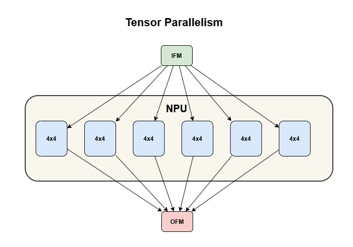
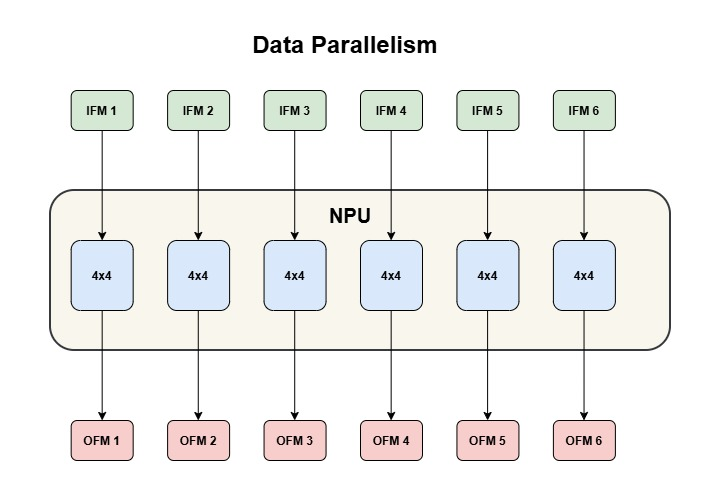
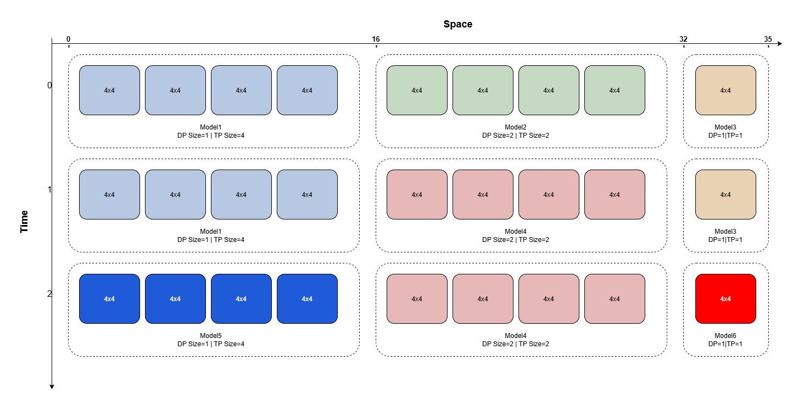

# Data Parallelism and Tensor Parallelism with Multi Tenancy

<!--
## Copyright and license statement

Copyright (C) 2026 Advanced Micro Devices, Inc.

Licensed under the Apache License, Version 2.0 (the "License"); you may not use this file except in compliance with the License. You may obtain a copy of the License at
[http://www.apache.org/licenses/LICENSE-2.0](http://www.apache.org/licenses/LICENSE-2.0).

Unless required by applicable law or agreed to in writing, software distributed under the License is distributed on an "AS IS" BASIS, WITHOUT WARRANTIES OR CONDITIONS OF ANY KIND, either express or implied. See the License for the specific language governing permissions and limitations under the License.
-->

## Overview of Data and Tensor Parallelism

The NPU on the Versal AI Edge Series Gen 2 VEK385 device has **36 columns** (numbered 0–35). Two types of parallelism determine how those columns are utilized by a compiled model:

- **Tensor Parallelism** — assigns multiple NPU tiles to a *single* model instance. Each tile spans 4 columns. Increasing tensor parallelism shards one inference across more tiles working in parallel, reducing **latency** for a single request.

  

  The diagram above shows tensor parallelism set to 6: a single input frame (IFM) is fanned out to all 6 tiles simultaneously. Each tile processes its assigned shard of the computation in parallel, and their partial results are combined to produce one output (OFM). Because all tiles cooperate on the same inference, the time to complete that one request is reduced compared to a single-tile execution.

- **Data Parallelism** — places multiple identical model replicas side by side on the NPU. Each replica receives its own independent input and runs concurrently, multiplying **throughput**.

  

  The diagram above shows data parallelism set to 6: six independent input frames (IFM1–IFM6) are sent to six identical model replicas at the same time. Each replica infers its own frame independently and produces its own output (OFM1–OFM6). Because all six inferences run in parallel, the NPU completes six requests in the same wall-clock time it would take to do one.

These two parallelism modes are controlled at **compilation time** via the `vitisai_config.json` file. The relevant parameters are:

- **`tp_size`** — sets the tensor parallelism; specifies the number of NPU tiles assigned to a single model instance.
- **`dp_size`** — sets the data parallelism; specifies the number of identical model replicas placed side by side on the NPU.

Each tile spans 4 columns, so the total NPU column footprint of a compiled model is `tp_size × dp_size × 4`.


## Overview of Multi Tenancy

- Multi tenancy allows several independently compiled models to run on the same NPU at the same time — either on separate column partitions (spatial) or on the same columns in turn (temporal).
- For a full description of the multi-tenancy runtime and placement policies, refer to [README.md](../cpp_examples/vart_multi_tenancy/README.md).

### Column Footprint and Placement Rules

The total column footprint of a compiled model is:

> **occupied_columns = tp_size × dp_size × 4**

| Configuration | `dp_size` | `tp_size` | NPU columns consumed |
| --- | --- | --- | --- |
| Data Parallelism 1 / Tensor Parallelism 1 | 1 | 1 | 1 × 1 × 4 = **4 cols** |
| Data Parallelism 1 / Tensor Parallelism 4 | 1 | 4 | 4 × 1 × 4 = **16 cols** |
| Data Parallelism 4 / Tensor Parallelism 1 | 4 | 1 | 1 × 4 × 4 = **16 cols** |
| Data Parallelism 2 / Tensor Parallelism 2 | 2 | 2 | 2 × 2 × 4 = **16 cols** |

All three 16-column variants consume the same NPU real estate, but for different purposes:
- **Data Parallelism 1 / Tensor Parallelism 4** — one model instance spread across 4 tiles (lower latency per inference)
- **Data Parallelism 4 / Tensor Parallelism 1** — four independent replicas in parallel (4× throughput)
- **Data Parallelism 2 / Tensor Parallelism 2** — two replicas, each spanning 2 tiles (balanced trade-off)

> **Key multi-tenancy rule:** models that share the same column zone via *temporal sharing* must be compiled with the *exact same* `dp_size` and `tp_size`. Only models with identical footprints can hot-swap the same NPU columns.


## Demonstration with an Example

Let's build a multi-model multi-tenancy use case with data and tensor parallelism as per the diagram below.

This page demonstrates through an example captured below:



The diagram above shows the combined spatial and temporal multi-tenancy layout across the 36 NPU columns. Three spatial zones run simultaneously side by side: Zone A (columns 0–15, `dp_size=1, tp_size=4`), Zone B (columns 16–31, `dp_size=2, tp_size=2`), and Zone C (columns 32–35, `dp_size=1, tp_size=1`). Within each zone, three different models time-share the same columns across three temporal slots — so six distinct models (three ResNet50 variants and three Yolox-m variants) are all running on the NPU at once.

To achieve this use case, let's split into the cases below:

1. Data Parallelism 1 / Tensor Parallelism 1
2. Data Parallelism 1 / Tensor Parallelism 4
3. Data Parallelism 4 / Tensor Parallelism 1 *(optional — skip if not needed)*
4. Data Parallelism 2 / Tensor Parallelism 2
5. Combine these models to run a multi-tenancy use case

---

## Prerequisites

### ONNX Models

This tutorial assumes you already have **pre-quantized INT8 ONNX models** for ResNet50 and YOLOX-m available on your host machine. Create the `onnx_models/` directory and place the model files inside it:

```bash
mkdir -p onnx_models
# Copy or move your INT8 ONNX models into this directory:
#   onnx_models/ResNet50_INT8.onnx
#   onnx_models/YOLOX_m_INT8.onnx
```

The following INT8 ONNX models are used in this tutorial:

| Model         | File                              | Input node    |
| ------------- | --------------------------------- | ------------- |
| ResNet50 INT8 | `onnx_models/ResNet50_INT8.onnx` | `input`       |
| YOLOX-m INT8  | `onnx_models/YOLOX_m_INT8.onnx`  | `images`      |

> **Note:** These are already quantized INT8 models — no further quantization step is needed. All `compile.py` commands in this tutorial reference these files directly.

### compile.py

`compile.py` is the compilation script used throughout this tutorial to compile an ONNX model for the NPU. It uses the **VitisAI Execution Provider** via ONNX Runtime to generate a compiled model cache (`.rai` file) that can be deployed on the target board.

```python
import onnxruntime
import argparse
import os

def main():
    parser = argparse.ArgumentParser(description='Run ONNX model inference with VitisAI')
    parser.add_argument('--model', '-m',
                        type=str,
                        required=True,
                        help='Path to ONNX model file')
    parser.add_argument('--cache_key', '-k',
                        type=str,
                        default=None,
                        help='Cache key for the model (default: model filename without extension)')
    parser.add_argument('--config', '-c',
                        type=str,
                        default='vitisai_config.json',
                        help='Path to VitisAI config file (default: vitisai_config.json)')
    parser.add_argument('--cache_dir', '-d',
                        type=str,
                        default='my_cache_dir',
                        help='Cache directory (default: my_cache_dir)')
    parser.add_argument('--target', '-t',
                        type=str,
                        default='VAIML',
                        help='Target device (default: VAIML)')

    args = parser.parse_args()

    if args.cache_key is None:
        model_basename = os.path.basename(args.model)
        args.cache_key = os.path.splitext(model_basename)[0]

    provider_options_dict = {
        "config_file": args.config,
        "cache_dir":   args.cache_dir,
        "cache_key":   args.cache_key,
        "target":      args.target
    }

    print(f"Creating ORT inference session for model {args.model}")
    print(f"Cache key: {args.cache_key}")
    print(f"Config file: {args.config}")
    print(f"Cache directory: {args.cache_dir}")
    print(f"Target: {args.target}")

    session = onnxruntime.InferenceSession(
        args.model,
        providers=["VitisAIExecutionProvider"],
        provider_options=[provider_options_dict]
    )

    print("Session created successfully!")
    return session

if __name__ == "__main__":
    session = main()
```

**Arguments:**

| Argument | Short | Default | Description |
| --- | --- | --- | --- |
| `--model` | `-m` | *(required)* | Path to the ONNX model file |
| `--cache_key` | `-k` | model filename (no ext) | Name used for the compiled cache directory and `.rai` file |
| `--config` | `-c` | `vitisai_config.json` | Path to the VitisAI compilation config |
| `--cache_dir` | `-d` | `my_cache_dir` | Root directory where compiled caches are written |
| `--target` | `-t` | `VAIML` | Target device |

---

> **Workflow summary:**
> - **Compilation** (`compile.py`) runs on the **host machine inside the Docker container** released as part of this package. For Docker setup instructions, refer to [UG1787 — Docker Setup](https://docs.amd.com/r/en-US/ug1787). Note that model compilation may take several minutes depending on the model size and host machine performance.
> - **Inference** (`vart_multi_tenancy`) runs on the **AMD Versal™ AI Edge Series Gen 2 VEK385 Evaluation Kit** (VEK385). Copy the compiled model caches (`my_cache/`) and runtime config JSONs (`json_configs/`) to the board before running. To keep the model running for an extended period — for example when observing NPU column occupation with `xrt-smi` — use the `-r` / `--runs` option (e.g. `-r 10000`).

> **Note:** This tutorial targets the **VEK385 evaluation kit**, which has **36 NPU columns** (2VE3858). The same concepts and workflow apply directly to other devices with fewer columns — for example **24 columns** (2VE3558) or **8 columns** (2VE3358). Simply adjust the `dp_size`, `tp_size`, and `start_column` values to fit the column count available on your target device.

---

## ResNet50 INT8 — Compilation and Inference

### Case 1 — Data Parallelism = 1 & Tensor Parallelism = 1

Take the ResNet50 INT8 ONNX model and compile with `tp_size=1` and `dp_size=1`.
This is the minimum-footprint configuration: one tile, **4 columns** (columns 0–3).

#### Model Compilation

Save the following as `vitisai_config_dp1tp1.json` inside the docker:

```json
{
  "passes": [
    {
      "name": "init",
      "plugin": "vaip-pass_init"
    },
    {
      "name": "vaiml_partition",
      "plugin": "vaip-pass_vaiml_partition",
      "vaiml_config": {
        "device": "ve2-xc2ve3858",
        "dp_size": 1,
        "tp_size": 1,
        "logging_level": "info",
        "fe_experiment": "edge-quantization-in-rt=1",
        "experiment_features": [
            "SkipDequantizeRemoval"
        ]
      }
    }
  ],
  "target": "VAIML",
  "targets": [
    {
      "name": "VAIML",
      "pass": ["init", "vaiml_partition"]
    }
  ]
}
```

```bash
python3 compile.py \
  --model     onnx_models/ResNet50_INT8.onnx \
  --cache_dir my_cache \
  --cache_key ResNet50_INT8_dp1tp1 \
  --config     vitisai_config_dp1tp1.json
```

The compiled model cache is written to `my_cache/ResNet50_INT8_dp1tp1/`. On successful compilation, a `ResNet50_INT8_dp1tp1.rai` file is created inside that directory.

#### Run Example

> **Note:** `start_column` is set to **32**, so the model will be loaded and run starting from column 32 on the NPU.

Save the following as `json_configs/resnet50_dp1tp1_config.json` on the board:

```json
[
  {
    "model_cache_path": "my_cache/ResNet50_INT8_dp1tp1/ResNet50_INT8_dp1tp1.rai",
    "start_column": 32,
    "aie_columns_sharing": true,
    "ifm_node_file_map": {
      "input": "/etc/vai/models/resnet50_int8/data/ifm_input_int8_1x224x224x4.bin"
    },
    "ofm_dir": "./out_resnet50_dp1tp1"
  }
]

```

```bash
vart_multi_tenancy --config json_configs/resnet50_dp1tp1_config.json --log-level 0
```

#### Results

```console
root@amd-edf:/home/amd-edf/test/multitenancy# vart_multi_tenancy --config json_configs/resnet50_dp1tp1_config.json --log-level 0
========== Overlay Column Assignments ==========
  start_column 32 : Model_1
================================================

========== Execution Summary ==========
-------------+-----------------+---------------------------------------------------------
Start Column | Models executed | OFMs file saved
-------------+-----------------+---------------------------------------------------------
32 (shared)  | Model_1         | ./out_resnet50_dp1tp1/ofm_model_1/output_1x1000_int8.bin
-------------+-----------------+---------------------------------------------------------
root@amd-edf:/home/amd-edf/rk/multi_tenancy# ./vart_multi_tenancy --config json_configs/resnet50_dp1tp1_config.json --log-level 0
========== Overlay Column Assignments ==========
  start_column 32 : Model_1
================================================

========== Execution Summary ==========
-------------+-----------------+---------------------------------------------------------
Start Column | Models executed | OFMs file saved
-------------+-----------------+---------------------------------------------------------
32 (shared)  | Model_1         | ./out_resnet50_dp1tp1/ofm_model_1/output_1x1000_int8.bin
-------------+-----------------+---------------------------------------------------------
```

To verify which NPU columns the model has occupied, use the `xrt-smi examine` utility. Run it before and during inference to observe the partition being claimed. Before inference, no hardware contexts are active:

```console
root@amd-edf:~# xrt-smi examine --device 0 --report aie-partitions

---------------------------
[0000:00:00.0] : Telluride
---------------------------
AIE Partitions
  No hardware contexts running on device
```

While the model is running, the partition shows columns 32 to 35 occupied:

```console
root@amd-edf:~# xrt-smi examine --device 0 --report aie-partitions

---------------------------
[0000:00:00.0] : Telluride
---------------------------
AIE Partitions
  Total Memory Usage: N/A
  Partition Index   : 0
    Columns: [32, 33, 34, 35]
    HW Contexts:
      |PID                 |Ctx ID     |Submissions |Migrations  |Err  |Priority |
      |Process Name        |Status     |Completions |Suspensions |     |GOPS     |
      |Memory Usage        |Instr BO   |            |            |     |FPS      |
      |                    |           |            |            |     |Latency  |
      |====================|===========|============|============|=====|=========|
      |1238                |1          |991         |0           |0    |Normal   |
      |N/A                 |Idle       |990         |0           |     |1        |
      |29228 KB            |N/A        |            |            |     |1        |
      |                    |           |            |            |     |2000     |
      |--------------------|-----------|------------|------------|-----|---------|
```

---

### Case 2 — Data Parallelism = 1 & Tensor Parallelism = 4

Take the ResNet50 INT8 ONNX model and compile with `tp_size=4` and `dp_size=1`.
One model instance spread across 4 tiles — **16 columns** (columns 0–15) — optimising for **lower latency**.

#### Model Compilation

Save the following as `vitisai_config_dp1tp4.json` inside the docker:

```json
{
  "passes": [
    {
      "name": "init",
      "plugin": "vaip-pass_init"
    },
    {
      "name": "vaiml_partition",
      "plugin": "vaip-pass_vaiml_partition",
      "vaiml_config": {
        "device": "ve2-xc2ve3858",
        "dp_size": 1,
        "tp_size": 4,
        "logging_level": "info",
        "fe_experiment": "edge-quantization-in-rt=1",
        "experiment_features": [
            "SkipDequantizeRemoval"
        ]
      }
    }
  ],
  "target": "VAIML",
  "targets": [
    {
      "name": "VAIML",
      "pass": ["init", "vaiml_partition"]
    }
  ]
}
```

```bash
python3 compile.py \
  --model     onnx_models/ResNet50_INT8.onnx \
  --cache_dir my_cache \
  --cache_key ResNet50_INT8_dp1tp4 \
  --config     vitisai_config_dp1tp4.json
```

The compiled model cache is written to `my_cache/ResNet50_INT8_dp1tp4/`. On successful compilation, a `ResNet50_INT8_dp1tp4.rai` file is created inside that directory.

#### Run Example

Save the following as `json_configs/resnet50_dp1tp4_config.json` on the board:

```json
[
  {
    "model_cache_path": "my_cache/ResNet50_INT8_dp1tp4/ResNet50_INT8_dp1tp4.rai",
    "start_column": 0,
    "aie_columns_sharing": true,
    "ifm_node_file_map": {
      "input": "/etc/vai/models/resnet50_int8/data/ifm_input_int8_1x224x224x4.bin"
    },
    "ofm_dir": "./out_resnet50_dp1tp4"
  }
]
```

```bash
vart_multi_tenancy --config json_configs/resnet50_dp1tp4_config.json --log-level 0
```

#### Results
```console
root@amd-edf:/home/amd-edf/test/multitenancy# vart_multi_tenancy --config json_configs/resnet50_dp1tp4_config.json --log-level 0
========== Overlay Column Assignments ==========
  start_column 0 : Model_1
================================================

========== Execution Summary ==========
-------------+-----------------+---------------------------------------------------------
Start Column | Models executed | OFMs file saved
-------------+-----------------+---------------------------------------------------------
0 (shared)   | Model_1         | ./out_resnet50_dp1tp4/ofm_model_1/output_1x1000_int8.bin
-------------+-----------------+---------------------------------------------------------

root@amd-edf:/home/amd-edf/test/multitenancy#
```

```console
root@amd-edf:~# xrt-smi examine --device 0 --report aie-partitions

---------------------------
[0000:00:00.0] : Telluride
---------------------------
AIE Partitions
  Total Memory Usage: N/A
  Partition Index   : 0
    Columns: [0, 1, 2, 3, 4, 5, 6, 7, 8, 9, 10, 11, 12, 13, 14, 15]
    HW Contexts:
      |PID                 |Ctx ID     |Submissions |Migrations  |Err  |Priority |
      |Process Name        |Status     |Completions |Suspensions |     |GOPS     |
      |Memory Usage        |Instr BO   |            |            |     |FPS      |
      |                    |           |            |            |     |Latency  |
      |====================|===========|============|============|=====|=========|
      |1351                |1          |657         |0           |0    |Normal   |
      |N/A                 |Idle       |656         |0           |     |1        |
      |32412 KB            |N/A        |            |            |     |1        |
      |                    |           |            |            |     |2000     |
      |--------------------|-----------|------------|------------|-----|---------|
root@amd-edf:~#
```

---

### Case 3 — Data Parallelism = 4 & Tensor Parallelism = 1 *(Optional)*

> **You can skip this case.** It is included to demonstrate that the compiler supports `dp_size=4, tp_size=1`. This configuration is **not used in Case 5** (which uses `dp_size=2, tp_size=2` for Zone B). Run it if you want to explore maximum-throughput compilation independently.

Take the ResNet50 INT8 ONNX model and compile with `tp_size=1` and `dp_size=4`.
Four independent replicas in parallel — **16 columns** (columns 0–15) — optimising for **maximum throughput** (4 inferences processed simultaneously).

#### Model Compilation

Save the following as `vitisai_config_dp4tp1.json` inside the docker:

```json
{
  "passes": [
    {
      "name": "init",
      "plugin": "vaip-pass_init"
    },
    {
      "name": "vaiml_partition",
      "plugin": "vaip-pass_vaiml_partition",
      "vaiml_config": {
        "device": "ve2-xc2ve3858",
        "dp_size": 4,
        "tp_size": 1,
        "logging_level": "info",
        "fe_experiment": "edge-quantization-in-rt=1",
        "experiment_features": [
            "SkipDequantizeRemoval"
        ]
      }
    }
  ],
  "target": "VAIML",
  "targets": [
    {
      "name": "VAIML",
      "pass": ["init", "vaiml_partition"]
    }
  ]
}
```

```bash
python3 compile.py \
  --model     onnx_models/ResNet50_INT8.onnx \
  --cache_dir my_cache \
  --cache_key ResNet50_INT8_dp4tp1 \
  --config     vitisai_config_dp4tp1.json
```

#### Run Example

Save the following as `json_configs/resnet50_dp4tp1_config.json` on the board:

```json
[
  {
    "model_cache_path": "my_cache/ResNet50_INT8_dp4tp1/ResNet50_INT8_dp4tp1.rai",
    "start_column": 0,
    "aie_columns_sharing": true,
    "ifm_node_file_map": {
      "input": "/etc/vai/models/resnet50_int8/data/ifm_input_int8_1x224x224x4.bin"
    },
    "ofm_dir": "./out_resnet50_dp4tp1"
  }
]
```

```bash
vart_multi_tenancy --config json_configs/resnet50_dp4tp1_config.json --log-level 0
```

#### Results

```console
root@amd-edf:/home/amd-edf/test/multitenancy# vart_multi_tenancy --config json_configs/resnet50_dp4tp1_config.json --log-level 0
========== Overlay Column Assignments ==========
  start_column 0 : Model_1
================================================

========== Execution Summary ==========
-------------+-----------------+---------------------------------------------------------
Start Column | Models executed | OFMs file saved
-------------+-----------------+---------------------------------------------------------
0 (shared)   | Model_1         | ./out_resnet50_dp4tp1/ofm_model_1/output_1x1000_int8.bin
-------------+-----------------+---------------------------------------------------------

```

<!-- TODO: Paste xrt-smi column occupation output here -->


### Case 4 — Data Parallelism = 2 & Tensor Parallelism = 2

Take the ResNet50 INT8 ONNX model and compile with `tp_size=2` and `dp_size=2`.
Two replicas, each spanning 2 tiles — **16 columns** (columns 0–15) — a balanced trade-off between latency and throughput.

#### Model Compilation

Save the following as `vitisai_config_dp2tp2.json` inside the docker:

```json
{
  "passes": [
    {
      "name": "init",
      "plugin": "vaip-pass_init"
    },
    {
      "name": "vaiml_partition",
      "plugin": "vaip-pass_vaiml_partition",
      "vaiml_config": {
        "device": "ve2-xc2ve3858",
        "dp_size": 2,
        "tp_size": 2,
        "logging_level": "info",
        "fe_experiment": "edge-quantization-in-rt=1",
        "experiment_features": [
            "SkipDequantizeRemoval"
        ]
      }
    }
  ],
  "target": "VAIML",
  "targets": [
    {
      "name": "VAIML",
      "pass": ["init", "vaiml_partition"]
    }
  ]
}
```

```bash
python3 compile.py \
  --model     onnx_models/ResNet50_INT8.onnx \
  --cache_dir my_cache \
  --cache_key ResNet50_INT8_dp2tp2 \
  --config     vitisai_config_dp2tp2.json
```

#### Run Example

> **Note:** `start_column` is set to **16**, so the model will be loaded and run starting from column 16 on the NPU.

Save the following as `json_configs/resnet50_dp2tp2_config.json` on the board:

```json
[
  {
    "model_cache_path": "my_cache/ResNet50_INT8_dp2tp2/ResNet50_INT8_dp2tp2.rai",
    "start_column": 16,
    "aie_columns_sharing": true,
    "ifm_node_file_map": {
      "input": "/etc/vai/models/resnet50_int8/data/ifm_input_int8_1x224x224x4.bin"
    },
    "ofm_dir": "./out_resnet50_dp2tp2"
  }
]
```

```bash
vart_multi_tenancy --config json_configs/resnet50_dp2tp2_config.json --log-level 0
```

#### Results

```console
root@amd-edf:/home/amd-edf# vart_multi_tenancy --config json_configs/resnet50_dp2tp2_config.json --log-level 0
========== Overlay Column Assignments ==========
  start_column 16 : Model_1
================================================

========== Execution Summary ==========
-------------+-----------------+---------------------------------------------------------
Start Column | Models executed | OFMs file saved
-------------+-----------------+---------------------------------------------------------
16 (shared)  | Model_1         | ./out_resnet50_dp2tp2/ofm_model_1/output_1x1000_int8.bin
-------------+-----------------+---------------------------------------------------------

```

```console
root@amd-edf:~# xrt-smi examine --device 0 --report aie-partitions

---------------------------
[0000:00:00.0] : Telluride
---------------------------
AIE Partitions
  Total Memory Usage: N/A
  Partition Index   : 0
    Columns: [16, 17, 18, 19, 20, 21, 22, 23, 24, 25, 26, 27, 28, 29, 30, 31]
    HW Contexts:
      |PID                 |Ctx ID     |Submissions |Migrations  |Frame Evts  |Err  |Priority |
      |Process Name        |Status     |Completions |Suspensions |Layer Evts  |     |GOPS     |
      |Memory Usage        |Instr BO   |            |            |            |     |FPS      |
      |                    |           |            |            |            |     |Latency  |
      |====================|===========|============|============|============|=====|=========|
      |918                 |1          |149         |0           |0           |0    |Normal   |
      |N/A                 |Idle       |148         |0           |0           |     |1        |
      |33052 KB            |N/A        |            |            |            |     |1        |
      |                    |           |            |            |            |     |2000     |
      |--------------------|-----------|------------|------------|------------|-----|---------|
```
---

## YOLOX-m INT8 — Compilation and Inference

The compilation steps for YOLOX-m follow the same structure as ResNet50. The same `vitisai_config_*.json` config files are reused — the `dp_size`/`tp_size` settings are model-agnostic.

### Case 1 — Data Parallelism = 1 & Tensor Parallelism = 1

#### Model Compilation

```bash
python3 compile.py \
  --model     onnx_models/YOLOX_m_INT8.onnx \
  --cache_dir my_cache \
  --cache_key YOLOX_m_INT8_dp1tp1 \
  --config     vitisai_config_dp1tp1.json
```

The compiled model cache is written to `my_cache/YOLOX_m_INT8_dp1tp1/`. On successful compilation, a `YOLOX_m_INT8_dp1tp1.rai` file is created inside that directory.

#### Run Example

Save the following as `json_configs/yoloxm_dp1tp1_config.json` on the board:

```json
[
  {
    "model_cache_path": "my_cache/YOLOX_m_INT8_dp1tp1/YOLOX_m_INT8_dp1tp1.rai",
    "start_column": 32,
    "aie_columns_sharing": true,
    "ifm_node_file_map": {
      "images": "/etc/vai/models/yolox_m_int8/data/ifm_images_int8_1x640x640x4.bin"
    },
    "ofm_dir": "./out_yoloxm_dp1tp1"
  }
]
```

```bash
vart_multi_tenancy --config json_configs/yoloxm_dp1tp1_config.json --log-level 0
```

#### Results

```console
root@amd-edf:/home/amd-edf/test/multitenancy# vart_multi_tenancy --config json_configs/yoloxm_dp1tp1_config.json --log-level 0
========== Overlay Column Assignments ==========
  start_column 32 : Model_1
================================================

========== Execution Summary ==========
-------------+-----------------+----------------------------------------------------------
Start Column | Models executed | OFMs file saved
-------------+-----------------+----------------------------------------------------------
32 (shared)  | Model_1         | ./out_yoloxm_dp1tp1/ofm_model_1/output_1x8400x88_int8.bin
-------------+-----------------+----------------------------------------------------------

```

Before inference, no hardware contexts are active:

```console
root@amd-edf:~# xrt-smi examine --device 0 --report aie-partitions

---------------------------
[0000:00:00.0] : Telluride
---------------------------
AIE Partitions
  No hardware contexts running on device
```

While the model is running, the partition shows columns 32 to 35 occupied:

```console
root@amd-edf:~# xrt-smi examine --device 0 --report aie-partitions

---------------------------
[0000:00:00.0] : Telluride
---------------------------
AIE Partitions
  Total Memory Usage: N/A
  Partition Index   : 0
    Columns: [32, 33, 34, 35]
    HW Contexts:
      |PID                 |Ctx ID     |Submissions |Migrations  |Err  |Priority |
      |Process Name        |Status     |Completions |Suspensions |     |GOPS     |
      |Memory Usage        |Instr BO   |            |            |     |FPS      |
      |                    |           |            |            |     |Latency  |
      |====================|===========|============|============|=====|=========|
      |1238                |1          |991         |0           |0    |Normal   |
      |N/A                 |Idle       |990         |0           |     |1        |
      |29228 KB            |N/A        |            |            |     |1        |
      |                    |           |            |            |     |2000     |
      |--------------------|-----------|------------|------------|-----|---------|
```

---

### Case 2 — Data Parallelism = 1 & Tensor Parallelism = 4

#### Model Compilation

```bash
python3 compile.py \
  --model     onnx_models/YOLOX_m_INT8.onnx \
  --cache_dir my_cache \
  --cache_key YOLOX_m_INT8_dp1tp4 \
  --config     vitisai_config_dp1tp4.json
```

The compiled model cache is written to `my_cache/YOLOX_m_INT8_dp1tp4/`. On successful compilation, a `YOLOX_m_INT8_dp1tp4.rai` file is created inside that directory.

#### Run Example

Save the following as `json_configs/yoloxm_dp1tp4_config.json` on the board:

```json
[
  {
    "model_cache_path": "my_cache/YOLOX_m_INT8_dp1tp4/YOLOX_m_INT8_dp1tp4.rai",
    "start_column": 0,
    "aie_columns_sharing": true,
    "ifm_node_file_map": {
      "images": "/etc/vai/models/yolox_m_int8/data/ifm_images_int8_1x640x640x4.bin"
    },
    "ofm_dir": "./out_yoloxm_dp1tp4"
  }
]
```

```bash
vart_multi_tenancy --config json_configs/yoloxm_dp1tp4_config.json --log-level 0
```

#### Results

```console
root@amd-edf:/home/amd-edf/test/multitenancy# vart_multi_tenancy --config json_configs/yoloxm_dp1tp4_config.json --log-level 0
========== Overlay Column Assignments ==========
  start_column 0 : Model_1
================================================

========== Execution Summary ==========
-------------+-----------------+----------------------------------------------------------
Start Column | Models executed | OFMs file saved
-------------+-----------------+----------------------------------------------------------
0 (shared)   | Model_1         | ./out_yoloxm_dp1tp4/ofm_model_1/output_1x8400x88_int8.bin
-------------+-----------------+----------------------------------------------------------
```

```console
root@amd-edf:~# xrt-smi examine -d 0 -r aie-partitions

---------------------------
[0000:00:00.0] : Telluride
---------------------------
AIE Partitions
  Total Memory Usage: N/A
  Partition Index   : 0
    Columns: [0, 1, 2, 3, 4, 5, 6, 7, 8, 9, 10, 11, 12, 13, 14, 15]
    HW Contexts:
      |PID                 |Ctx ID     |Submissions |Migrations  |Err  |Priority |
      |Process Name        |Status     |Completions |Suspensions |     |GOPS     |
      |Memory Usage        |Instr BO   |            |            |     |FPS      |
      |                    |           |            |            |     |Latency  |
      |====================|===========|============|============|=====|=========|
      |899                 |1          |1040        |0           |0    |Normal   |
      |N/A                 |Idle       |1039        |0           |     |1        |
      |43968 KB            |N/A        |            |            |     |1        |
      |                    |           |            |            |     |2000     |
      |--------------------|-----------|------------|------------|-----|---------|
root@amd-edf:~#
```

---

### Case 3 — Data Parallelism = 4 & Tensor Parallelism = 1 *(Optional)*

> **You can skip this case.** It demonstrates that the compiler supports `dp_size=4, tp_size=1` for YOLOX-m. This configuration is **not used in Case 5**. Run it if you want to explore maximum-throughput compilation independently.

#### Model Compilation

```bash
python3 compile.py \
  --model     onnx_models/YOLOX_m_INT8.onnx \
  --cache_dir my_cache \
  --cache_key YOLOX_m_INT8_dp4tp1 \
  --config     vitisai_config_dp4tp1.json
```

The compiled model cache is written to `my_cache/YOLOX_m_INT8_dp4tp1/`. On successful compilation, a `YOLOX_m_INT8_dp4tp1.rai` file is created inside that directory.

#### Run Example

Save the following as `json_configs/yoloxm_dp4tp1_config.json` on the board:

```json
[
  {
    "model_cache_path": "my_cache/YOLOX_m_INT8_dp4tp1/YOLOX_m_INT8_dp4tp1.rai",
    "start_column": 0,
    "aie_columns_sharing": true,
    "ifm_node_file_map": {
      "images": "/etc/vai/models/yolox_m_int8/data/ifm_images_int8_1x640x640x4.bin"
    },
    "ofm_dir": "./out_yoloxm_dp4tp1"
  }
]
```

```bash
vart_multi_tenancy --config json_configs/yoloxm_dp4tp1_config.json --log-level 0
```

#### Results

```console
root@amd-edf:/home/amd-edf/test/multitenancy# vart_multi_tenancy --config json_configs/yoloxm_dp4tp1_config.json --log-level 0
========== Overlay Column Assignments ==========
  start_column 0 : Model_1
================================================

========== Execution Summary ==========
-------------+-----------------+----------------------------------------------------------
Start Column | Models executed | OFMs file saved
-------------+-----------------+----------------------------------------------------------
0 (shared)   | Model_1         | ./out_yoloxm_dp4tp1/ofm_model_1/output_1x8400x88_int8.bin
-------------+-----------------+----------------------------------------------------------
```

<!-- TODO: Paste xrt-smi column occupation output here -->

---

### Case 4 — Data Parallelism = 2 & Tensor Parallelism = 2

Two replicas, each spanning 2 tiles — **16 columns** (columns 0–15) — a balanced trade-off between latency and throughput.

> **Note:** `start_column` is set to **16**, so the model will be loaded and run starting from column 16 on the NPU.

#### Model Compilation

```bash
python3 compile.py \
  --model     onnx_models/YOLOX_m_INT8.onnx \
  --cache_dir my_cache \
  --cache_key YOLOX_m_INT8_dp2tp2 \
  --config     vitisai_config_dp2tp2.json
```

The compiled model cache is written to `my_cache/YOLOX_m_INT8_dp2tp2/`. On successful compilation, a `YOLOX_m_INT8_dp2tp2.rai` file is created inside that directory.

#### Run Example

Save the following as `json_configs/yoloxm_dp2tp2_config.json` on the board:

```json
[
  {
    "model_cache_path": "my_cache/YOLOX_m_INT8_dp2tp2/YOLOX_m_INT8_dp2tp2.rai",
    "start_column": 16,
    "aie_columns_sharing": true,
    "ifm_node_file_map": {
      "images": "/etc/vai/models/yolox_m_int8/data/ifm_images_int8_1x640x640x4.bin"
    },
    "ofm_dir": "./out_yoloxm_dp2tp2"
  }
]
```

```bash
vart_multi_tenancy --config json_configs/yoloxm_dp2tp2_config.json --log-level 0
```

#### Results

```console
root@amd-edf:/home/amd-edf# vart_multi_tenancy --config json_configs/yoloxm_dp2tp2_config.json --log-level 0
========== Overlay Column Assignments ==========
  start_column 16 : Model_1
================================================

========== Execution Summary ==========
-------------+-----------------+----------------------------------------------------------
Start Column | Models executed | OFMs file saved
-------------+-----------------+----------------------------------------------------------
16 (shared)  | Model_1         | ./out_yoloxm_dp2tp2/ofm_model_1/output_1x8400x88_int8.bin
-------------+-----------------+----------------------------------------------------------
```
```console
root@amd-edf:~# xrt-smi examine --device 0 --report aie-partitions

---------------------------
[0000:00:00.0] : Telluride
---------------------------
AIE Partitions
  Total Memory Usage: N/A
  Partition Index   : 0
    Columns: [16, 17, 18, 19, 20, 21, 22, 23, 24, 25, 26, 27, 28, 29, 30, 31]
    HW Contexts:
      |PID                 |Ctx ID     |Submissions |Migrations  |Frame Evts  |Err  |Priority |
      |Process Name        |Status     |Completions |Suspensions |Layer Evts  |     |GOPS     |
      |Memory Usage        |Instr BO   |            |            |            |     |FPS      |
      |                    |           |            |            |            |     |Latency  |
      |====================|===========|============|============|============|=====|=========|
      |1000                |1          |183         |0           |0           |0    |Normal   |
      |N/A                 |Idle       |182         |0           |0           |     |1        |
      |57356 KB            |N/A        |            |            |            |     |1        |
      |                    |           |            |            |            |     |2000     |
      |--------------------|-----------|------------|------------|------------|-----|---------|
```
---

### Case 5 — Combined Spatial and Temporal Multi-Tenancy (ResNet50 + YOLOX-m)

This case combines **both ResNet50 and Yolox-m** models into a single run that uses all 36 NPU columns simultaneously across **3 spatial zones** and **3 temporal time slots**, as shown in the diagram. For this example, **Zone A** refers to columns 0–15, **Zone B** to columns 16–31, and **Zone C** to columns 32–35.


**Spatial layout** (all three zones run in parallel):

| Zone    | Columns | `dp_size` | `tp_size` | Footprint        |
| ------- | ------- | --------- | --------- | ---------------- |
| Zone A  | 0 – 15  | 1         | 4         | 1×4×4 = 16 cols  |
| Zone B  | 16 – 31 | 2         | 2         | 2×2×4 = 16 cols  |
| Zone C  | 32 – 35 | 1         | 1         | 1×1×4 = 4 cols   |

**Temporal layout** (models hot-desk within each zone):

| Time slot | Zone A (cols 0–15)   | Zone B (cols 16–31)  | Zone C (cols 32–35)  |
| --------- | -------------------- | -------------------- | -------------------- |
| Time 0    | resnet50\_dp1tp4     | resnet50\_dp2tp2     | resnet50\_dp1tp1     |
| Time 1    | resnet50\_dp1tp4     | yoloxm\_dp2tp2       | resnet50\_dp1tp1     |
| Time 2    | yoloxm\_dp1tp4       | yoloxm\_dp2tp2       | yoloxm\_dp1tp1       |

> **Key rule:** all models sharing a zone must have the **same `dp_size` and `tp_size`** so their column footprints match exactly. Setting `aie_columns_sharing: true` on every entry enables the hardware scheduler to time-multiplex them.

Save the following as `json_configs/multi_tenancy_config.json` on the board:

```json
[
  {
    "model_cache_path": "my_cache/ResNet50_INT8_dp1tp4/ResNet50_INT8_dp1tp4.rai",
    "start_column": 0,
    "aie_columns_sharing": true,
    "ifm_node_file_map": {
      "input": "/etc/vai/models/resnet50_int8/data/ifm_input_int8_1x224x224x4.bin"
    },
    "ofm_dir": "./out_resnet50_dp1tp4_t0"
  },
  {
    "model_cache_path": "my_cache/ResNet50_INT8_dp1tp4/ResNet50_INT8_dp1tp4.rai",
    "start_column": 0,
    "aie_columns_sharing": true,
    "ifm_node_file_map": {
      "input": "/etc/vai/models/resnet50_int8/data/ifm_input_int8_1x224x224x4.bin"
    },
    "ofm_dir": "./out_resnet50_dp1tp4_t1"
  },
  {
    "model_cache_path": "my_cache/YOLOX_m_INT8_dp1tp4/YOLOX_m_INT8_dp1tp4.rai",
    "start_column": 0,
    "aie_columns_sharing": true,
    "ifm_node_file_map": {
      "images": "/etc/vai/models/yolox_m_int8/data/ifm_images_int8_1x640x640x4.bin"
    },
    "ofm_dir": "./out_yoloxm_dp1tp4_t2"
  },
  {
    "model_cache_path": "my_cache/ResNet50_INT8_dp2tp2/ResNet50_INT8_dp2tp2.rai",
    "start_column": 16,
    "aie_columns_sharing": true,
    "ifm_node_file_map": {
      "input": "/etc/vai/models/resnet50_int8/data/ifm_input_int8_1x224x224x4.bin"
    },
    "ofm_dir": "./out_resnet50_dp2tp2_t0"
  },
  {
    "model_cache_path": "my_cache/YOLOX_m_INT8_dp2tp2/YOLOX_m_INT8_dp2tp2.rai",
    "start_column": 16,
    "aie_columns_sharing": true,
    "ifm_node_file_map": {
      "images": "/etc/vai/models/yolox_m_int8/data/ifm_images_int8_1x640x640x4.bin"
    },
    "ofm_dir": "./out_yoloxm_dp2tp2_t1"
  },
  {
    "model_cache_path": "my_cache/YOLOX_m_INT8_dp2tp2/YOLOX_m_INT8_dp2tp2.rai",
    "start_column": 16,
    "aie_columns_sharing": true,
    "ifm_node_file_map": {
      "images": "/etc/vai/models/yolox_m_int8/data/ifm_images_int8_1x640x640x4.bin"
    },
    "ofm_dir": "./out_yoloxm_dp2tp2_t2"
  },
  {
    "model_cache_path": "my_cache/ResNet50_INT8_dp1tp1/ResNet50_INT8_dp1tp1.rai",
    "start_column": 32,
    "aie_columns_sharing": true,
    "ifm_node_file_map": {
      "input": "/etc/vai/models/resnet50_int8/data/ifm_input_int8_1x224x224x4.bin"
    },
    "ofm_dir": "./out_resnet50_dp1tp1_t0"
  },
  {
    "model_cache_path": "my_cache/ResNet50_INT8_dp1tp1/ResNet50_INT8_dp1tp1.rai",
    "start_column": 32,
    "aie_columns_sharing": true,
    "ifm_node_file_map": {
      "input": "/etc/vai/models/resnet50_int8/data/ifm_input_int8_1x224x224x4.bin"
    },
    "ofm_dir": "./out_resnet50_dp1tp1_t1"
  },
  {
    "model_cache_path": "my_cache/YOLOX_m_INT8_dp1tp1/YOLOX_m_INT8_dp1tp1.rai",
    "start_column": 32,
    "aie_columns_sharing": true,
    "ifm_node_file_map": {
      "images": "/etc/vai/models/yolox_m_int8/data/ifm_images_int8_1x640x640x4.bin"
    },
    "ofm_dir": "./out_yoloxm_dp1tp1_t2"
  }
]
```

```bash
vart_multi_tenancy --config json_configs/multi_tenancy_config.json --log-level 0
```

#### Results

```console
root@amd-edf:/home/amd-edf# vart_multi_tenancy --config json_configs/multi_tenancy_config.json --log-level 0
========== Overlay Column Assignments ==========
  start_column 0 : Model_1, Model_2, Model_3
  start_column 16 : Model_4, Model_5, Model_6
  start_column 32 : Model_7, Model_8, Model_9
================================================

========== Execution Summary ==========
-------------+-----------------+-------------------------------------------------------------
Start Column | Models executed | OFMs file saved
-------------+-----------------+-------------------------------------------------------------
0 (shared)   | Model_1         | ./out_resnet50_dp1tp4_t0/ofm_model_1/output_1x1000_int8.bin
0 (shared)   | Model_2         | ./out_resnet50_dp1tp4_t1/ofm_model_2/output_1x1000_int8.bin
0 (shared)   | Model_3         | ./out_yoloxm_dp1tp4_t2/ofm_model_3/output_1x8400x88_int8.bin
16 (shared)  | Model_4         | ./out_resnet50_dp2tp2_t0/ofm_model_4/output_1x1000_int8.bin
16 (shared)  | Model_5         | ./out_yoloxm_dp2tp2_t1/ofm_model_5/output_1x8400x88_int8.bin
16 (shared)  | Model_6         | ./out_yoloxm_dp2tp2_t2/ofm_model_6/output_1x8400x88_int8.bin
32 (shared)  | Model_7         | ./out_resnet50_dp1tp1_t0/ofm_model_7/output_1x1000_int8.bin
32 (shared)  | Model_8         | ./out_resnet50_dp1tp1_t1/ofm_model_8/output_1x1000_int8.bin
32 (shared)  | Model_9         | ./out_yoloxm_dp1tp1_t2/ofm_model_9/output_1x8400x88_int8.bin
-------------+-----------------+-------------------------------------------------------------

========== Performance ==========
+----------------+------------+---------------------------+--------------------------------+
| Models per Run | Total Runs | Total inference time (ms) | Avg inference for one Run (ms) |
+----------------+------------+---------------------------+--------------------------------+
| 9              | 1          | 47.97                     | 47.97                          |
+----------------+------------+---------------------------+--------------------------------+
Models per Run : Number of models configured for execution in a single run.
Total Runs     : Number of times configured full model set inference cycle is repeated.
Avg inference  : Total inference time divided by Total Runs.

```
```console
root@amd-edf:~# xrt-smi examine --device 0 --report aie-partitions

---------------------------
[0000:00:00.0] : Telluride
---------------------------
AIE Partitions
  Total Memory Usage: N/A
  Partition Index   : 0
    Columns: [0, 1, 2, 3, 4, 5, 6, 7, 8, 9, 10, 11, 12, 13, 14, 15]
    HW Contexts:
      |PID                 |Ctx ID     |Submissions |Migrations  |Frame Evts  |Err  |Priority |
      |Process Name        |Status     |Completions |Suspensions |Layer Evts  |     |GOPS     |
      |Memory Usage        |Instr BO   |            |            |            |     |FPS      |
      |                    |           |            |            |            |     |Latency  |
      |====================|===========|============|============|============|=====|=========|
      |1126                |1          |200         |0           |0           |0    |Normal   |
      |N/A                 |Active     |200         |0           |0           |     |1        |
      |348 MB              |N/A        |            |            |            |     |1        |
      |                    |           |            |            |            |     |2000     |
      |--------------------|-----------|------------|------------|------------|-----|---------|
      |1126                |2          |100         |0           |0           |0    |Normal   |
      |N/A                 |Active     |100         |0           |0           |     |1        |
      |348 MB              |N/A        |            |            |            |     |1        |
      |                    |           |            |            |            |     |2000     |
      |--------------------|-----------|------------|------------|------------|-----|---------|
  Partition Index   : 1
    Columns: [16, 17, 18, 19, 20, 21, 22, 23, 24, 25, 26, 27, 28, 29, 30, 31]
    HW Contexts:
      |PID                 |Ctx ID     |Submissions |Migrations  |Frame Evts  |Err  |Priority |
      |Process Name        |Status     |Completions |Suspensions |Layer Evts  |     |GOPS     |
      |Memory Usage        |Instr BO   |            |            |            |     |FPS      |
      |                    |           |            |            |            |     |Latency  |
      |====================|===========|============|============|============|=====|=========|
      |1126                |3          |49          |0           |0           |0    |Normal   |
      |N/A                 |Idle       |48          |0           |0           |     |1        |
      |348 MB              |N/A        |            |            |            |     |1        |
      |                    |           |            |            |            |     |2000     |
      |--------------------|-----------|------------|------------|------------|-----|---------|
      |1126                |4          |141         |0           |0           |0    |Normal   |
      |N/A                 |Idle       |139         |0           |0           |     |1        |
      |348 MB              |N/A        |            |            |            |     |1        |
      |                    |           |            |            |            |     |2000     |
      |--------------------|-----------|------------|------------|------------|-----|---------|
  Partition Index   : 2
    Columns: [32, 33, 34, 35]
    HW Contexts:
      |PID                 |Ctx ID     |Submissions |Migrations  |Frame Evts  |Err  |Priority |
      |Process Name        |Status     |Completions |Suspensions |Layer Evts  |     |GOPS     |
      |Memory Usage        |Instr BO   |            |            |            |     |FPS      |
      |                    |           |            |            |            |     |Latency  |
      |====================|===========|============|============|============|=====|=========|
      |1126                |5          |200         |0           |0           |0    |Normal   |
      |N/A                 |Active     |200         |0           |0           |     |1        |
      |348 MB              |N/A        |            |            |            |     |1        |
      |                    |           |            |            |            |     |2000     |
      |--------------------|-----------|------------|------------|------------|-----|---------|
      |1126                |6          |93          |0           |0           |0    |Normal   |
      |N/A                 |Idle       |92          |0           |0           |     |1        |
      |348 MB              |N/A        |            |            |            |     |1        |
      |                    |           |            |            |            |     |2000     |
      |--------------------|-----------|------------|------------|------------|-----|---------|

```