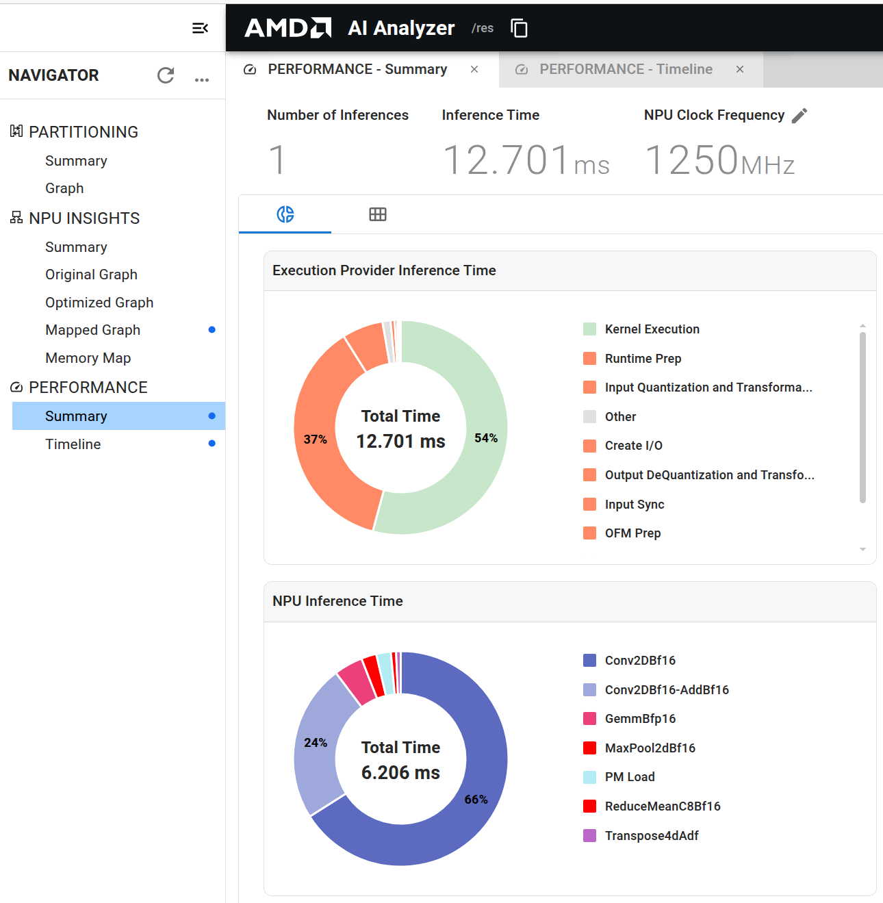
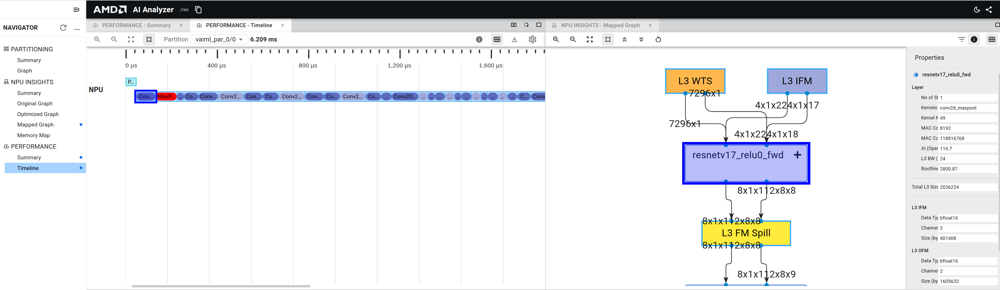

<table class="sphinxhide" width="100%">
 <tr width="100%">
    <td align="center"><h1> Build a C++ Inference Application for ResNet-50</h1>
    </td>
 </tr>
</table>

This tutorial outlines the essential steps for deploying the Resnet50 model on AMD Versal AI Edge Series Gen 2 VEK385 Evaluation Kit (Rev B)
using ONNX RT C++ Application.

The process begins with getting the resnet50 model from HuggingFace ONNX Model Zoo. The model is then compiled for NPU execution using Vitis AI, which prepares it for execution. Finally, a C++ application is used to run inference on the VEK385 evaluation kit, demonstrating the complete workflow from model preparation to deployment. This tutorial provides a comprehensive guide for developers looking to leverage AMD's Vitis AI platform for efficient model deployment on AMD edge devices.


## System Requirements

This tutorial requires:

* Vitis AI 6.2 Docker for Versal AI Edge Series Gen 2:
  * Instructions for installation and startup are in the Vitis AI User Guide for Versal AI Edge Series Gen 2.
* VEK385 evaluation kit:
  * Setup instructions are available in the Vitis AI User Guide for Versal AI Edge Series Gen 2.
* Internet access:
  * Necessary for downloading resources.
  * Download resnet50 ONNX model from HuggingFace ONNX Model Zoo
* AIE-ML_v2 license file:
  * For license file, follow instructions in the Vitis AI User Guide for Versal AI Edge Series Gen 2.

## What You Will Accomplish

You will:

* Download Resnet50 model from HuggingFace ONNX Model Zoo
* Compile using Vitis AI compiler
* Run Inference on VEK385 NPU using AMD Vitis AI Execution Provider

## Tutorial Workflow

### Download Resnet50 ONNX model from HuggingFace Model Zoo

On your host machine, download the ResNet50 ONNX float model from the [onnxmodelzoo](https://huggingface.co/onnxmodelzoo) model zoo:

```bash
cd <path/to/resnet50Cpp>
```

Get the ONNX model using:

```bash
wget -P models https://huggingface.co/onnxmodelzoo/resnet50-v1-12/resolve/main/resnet50-v1-12.onnx
chmod a+w models
```

**Note:** as a shorthand you can run `getResnet50.sh`.


### Prepare and Run Docker

Before starting Docker, adjust the access permissions of the working directories on the host machine:

```bash
cd ..
chmod -R a+w resnet50Cpp
```

Load the docker image:

```bash
docker load -i <docker_image_file>.tgz
```

Run `docker images` to verify docker REPOSITORY, IMAGEID and TAG information.

|REPOSITORY          | TAG               | IMAGE ID    | CREATED       | SIZE   |
|--------------------|-------------------|-------------|---------------|--------|
|vitis_ai_2ve_docker | release_v6.2      |   ??????    |  xx hours ago | 39.1GB |

Start the docker:

```bash
docker run -it --network host \  
  -v /path/to/your/license:/usr/licenses \  
  -v $PWD/resnet50Cpp:/resnet50Cpp \  
  --rm vitis_ai_2ve_docker:release_v6.2  "bash"
```
### Model Compilation

Compile the resnet50 ONNX model `models/resnet50-v1-12.onnx` for the NPU.

The `compile.py` file has the following content:

```PYTHON
import onnxruntime

provider_options_dict = {
        "config_file": 'vitisai_config.json',
        "cache_dir":   'vek385_cache_dir',
        "cache_key":   'resnet50-v1-12',
        "log_level":   'info',
        "target": "VAIML"
}

session = onnxruntime.InferenceSession(
        'models/resnet50-v1-12.onnx',
        providers=["VitisAIExecutionProvider"],
        provider_options=[provider_options_dict]
)
```

There is also a Vitis AI configuration file `vitisai_config.json` used to set compiler parameters:

```JSON
{
 "passes": [
         {
                 "name": "init",
                 "plugin": "vaip-pass_init"
         },
         {
                 "name": "vaiml_partition",
                 "plugin": "vaip-pass_vaiml_partition",
                 "vaiml_config": {
                        "device": "ve2-xc2ve3858",
                        "keep_outputs": true,
                        "optimize_level": 2,
                        "threshold_gops_percent": 20,
                        "log_level": "info"
                }
         }
 ],
 "target": "VAIML",
 "targets": [
    {
        "name": "VAIML",
        "pass": [
            "init",
            "vaiml_partition"
        ]
    }
 ]
}
```

Run Vitis AI compilation with the following command:

```BASH
cd /resnet50Cpp
python3 compile.py
```

It takes time to compile the model. After compilation you get the following output:

```BASH
subpartition path = vek385_cache_dir/resnet50-v1-12/vaiml_par_0/0
INFO: [VAIP-VAIML-PASS] No. of Operators : 
INFO:  VAIML     122
INFO: [VAIP-VAIML-PASS] No. of Subgraphs : 
INFO:    NPU     1
INFO: [VAIP-VAIML-PASS] For detailed compilation results, please refer to vek385_cache_dir/resnet50-v1-12/final-vaiml-pass-summary.txt
```

You can get more details about the compilation results by displaying the content of `vek385_cache_dir/resnet50-v1-12/final-vaiml-pass-summary.txt`:

```TEXT
--------- Final Summary of VAIML Pass ----------
OS: Linux X64
VAIP commit: d8989815f577491df76b036d70e3a49dc0298834
Model: /resnet50Cpp/models/resnet50-v1-12.onnx
Model signature: b22a4def363ba60ead114db2dbfe6dd0
Device: ve2-xc2ve3858
Model data type: float32
Device data type: bfloat16
Number of operators in the model: 122
GOPs of the model: 7.76806
Number of operators supported by VAIML: 122 (100.000%)
GOPs supported by VAIML: 7.768 (100.000%)
Number of subgraphs supported by VAIML: 1
Number of operators offloaded by VAIML: 122 (100.000%)
GOPs offloaded by VAIML: 7.768 (100.000%)
Number of subgraphs offloaded by VAIML: 1
Number of subgraphs with compilation errors (fall back to CPU): 0
Number of subgraphs below 20% GOPs threshold (fall back to CPU): 0
Number of subgraphs above max number of subgraphs allowed(7): 0 (fall back to CPU)
Stats for offloaded subgraphs
Subgraph vaiml_par_0 stats: 
    Type: npu
    Operators: 122 (100.000%)
    GOPs : 7.768 (100.000%)  OPs: 7,768,063,056
```

The next step doesn't need the docker environment so you can exit using:

```BASH
exit
```


### Inference Using C++ Application

The next step is to run inference on the hardware board. A C++ application is available in `input.cpp`. This file has to be compiled for the VEK385 evaluation kit.

On the host machine environment you have to install sysroot, if not already done, and then cross-compile the application.

#### Install Sysroot

The sysroot provides the cross-compilation environment and libraries required to build applications for the target device. If the sysroot is not installed, complete the following steps before cross-compiling target applications on the host machine.

```BASH
# Copy the SDK installer to a temporary location.
cp vitis_ai_2ve_sdk_v6.2.sh /tmp/sdk.sh

# Make the installer executable.
chmod +x /tmp/sdk.sh

# Clear the library path to avoid conflicts.
unset LD_LIBRARY_PATH

# Install the SDK to the specified path.
/tmp/sdk.sh -y -d <SYSROOT_PATH>
```

You can now set up the cross-compile environment using:

```BASH
# Source the sysroot environment for cross-compilation.
source <SYSROOT_PATH>/environment-setup-cortexa72-cortexa53-amd-linux
```

> **Note:**
>
> Don't forget to `unset LD_LIBRARY_PATH` if the SDK was already installed.


#### Cross-compile the application

The C++ Application is performing a number of tasks:

- load a raw input file: `.bin` extension
- run inference using ONNX RT
- save output in raw format: `.bin` extension

The C++ host application is available in `input.cpp`. Compile and link the host application using the following commands:

```BASH
$CXX -I$SDKTARGETSYSROOT/usr/include -I$SDKTARGETSYSROOT/usr/include/onnxruntime/core/session -O2 -pipe -g -feliminate-unused-debug-types -o input.o -c ./input.cpp

$CXX -O2 -pipe -g -feliminate-unused-debug-types  -Wl,-O1 -Wl,--hash-style=gnu -Wl,--as-needed  -Wl,-z,relro,-z,now -rdynamic "input.o" -o model-app.elf -L$SDKTARGETSYSROOT/usr/lib -Wl,-rpath,$SDKTARGETSYSROOT/usr/lib -lonnxruntime
```

**Note:** as a shorthand you can run `CppAppCompile.sh`.

#### Helper function

The C++ application reads binary files, which are not available as is. There is a helper function `runhelper.py` that generates a random image of the correct size and saves it in binary format along with the corresponding model output.

This file will be run on hardware before the C++ application to generate the binary files.


#### Run Inference

To deploy the compiled model with the C++ application:

- Ensure the VEK385 evaluation kit is set up as outlined in the board_setup or board_setup_ospi_sd instructions.
- Transfer the resnet50 prebuilt directory to the board. Make sure the options config_file, cacheDir and cacheKey in input.cpp point to the correct locations.
- Execute inference using the compiled C++ application

Once the board has been booted up and the resnet50 model directory transferred to the board, run the commands below (`runhelper.py` helps generate input data for the C++ application for demonstration purposes):

```bash
export DEBUG_LOG_LEVEL=info
python3 runhelper.py
./model-app.elf vek385_cache_dir/resnet50-v1-12/resnet50-v1-12.onnx input0.bin output0.bin
```

The output should look like:

```TEXT
I20250529 18:50:23.824052   958 stat.cpp:193] [Vitis AI EP] No. of Operators :
I20250529 18:50:23.824097   958 stat.cpp:204]  VAIML   122 
I20250529 18:50:23.824107   958 stat.cpp:213] 
I20250529 18:50:23.824115   958 stat.cpp:218] [Vitis AI EP] No. of Subgraphs :
I20250529 18:50:23.824122   958 stat.cpp:226]    NPU     1 
I20250529 18:50:23.824127   958 stat.cpp:229] Actually running on NPU      1
I20250529 18:50:23.825973   958 vitisai_compile_model.cpp:1477] AVG CPU Usage 3.97351%
I20250529 18:50:23.826004   958 vitisai_compile_model.cpp:1478] Peak Working Set size 109.703 MB
```

### AI Analyzer view

The C++ application has been designed to generate visualization and profiling data for AI Analyzer:

```C++
    // Set VitisAI-specific options
    std::unordered_map<std::string, std::string> options;
    options["config_file"] = "./vitisai_config.json";  // Config file
    options["cacheDir"] = "./vek385_cache_dir";  // Cache dir used to compile the model, should match compilation result.
    options["cacheKey"] = "resnet50-v1-12"; // Cache key used to compile the model, should match compilation result.
    options["ai_analyzer_visualization"] = "True"; // Visualization in AI analyzer
    options["ai_analyzer_profiling"] = "True"; // Profiling in AI analyzer
    options["target"] = "VAIML"; // Target Platform
```

The flags related to artifact generation for AI Analyzer are `ai_analyzer_profiling` and `ai_analyzer_visualization`:
- `ai_analyzer_profiling`: Enables generation of artifacts related to the inference profile.
- `ai_analyzer_visualization`: Enables generation of artifacts related to graph partitions and operator fusion.

These artifacts are generated as JSON files in the current run directory upon executing `model-app.elf`.

#### Launch AI Analyzer

Once the JSON files are generated, launch AI Analyzer.

```BASH
docker run -it -p 8011:8011 --network host \
  -v /path/to/your/license:/usr/licenses \
  -v $PWD/resnet50Cpp:/resnet50Cpp \
  --rm vitis_ai_2ve_docker:release_v6.2 "bash"
```

Inside docker, launch AI Analyzer:

```BASH
root@019935d3026b:/home# aianalyzer --port 8011 --no-browser --bind 0.0.0.0 /resnet50Cpp
```

After the above step, there will be a message like:

```BASH
Loaded ONNX model from /resnet50Cpp/vek385_cache_dir/resnet50-v1-12/vaiml_partition_fe.flexml/vaiml_optimized.onnx
2026-02-19 14:27:03,927     INFO [client_id=n/a] 134292084618944 server.py:35 AI Analyzer 1.7.0.dev20260130181427+g301504b8 serving on http://0.0.0.0:8011/dashboard?token=9a78MONMv8unkzAnkNNcJZ9OepfpuaFXphYsVxuvA (Press CTRL+C to quit)
```

In the host machine, start a browser and type the address from above message:

```BASH
http://0.0.0.0:8011/dashboard?token=9a78MONMv8unkzAnkNNcJZ9OepfpuaFXphYsVxuvA
```

In AI Analyzer you have access to various tabs with information about the model, its partitions, profiling and visualization data. 

After running the model on hardware, you can access `PERFORMANCE` views with `Summary`, which provides a global average of the inference time and the NPU inference time, and `Timeline`, which provides a detailed view of the inference timeline with CPU and NPU activities.

##### Performance Summary



##### Performance Timeline



In this screenshot we can also view in parallel the timeline and the ``Mapped Graph`` to understand the relationship between layers in the model and the activities on the timeline. 


### Summary

This tutorial demonstrated the complete workflow for deploying resnet50 on the VEK385 evaluation kit using Vitis AI and a C++ host application:

1. **Model Preparation**: Downloaded resnet50 from HuggingFace Model Zoo.

2. **Model Compilation**: Compiled the ONNX model for the NPU to run on the VEK385 NPU.

3. **C++ Application for Inference**: Used a C++ application on the VEK385 evaluation kit to perform inference on an example input image.


## License

The MIT License (MIT)

Copyright (c) 2025 Advanced Micro Devices, Inc. All rights reserved.

