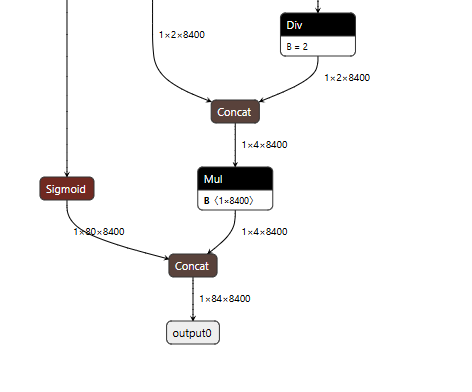
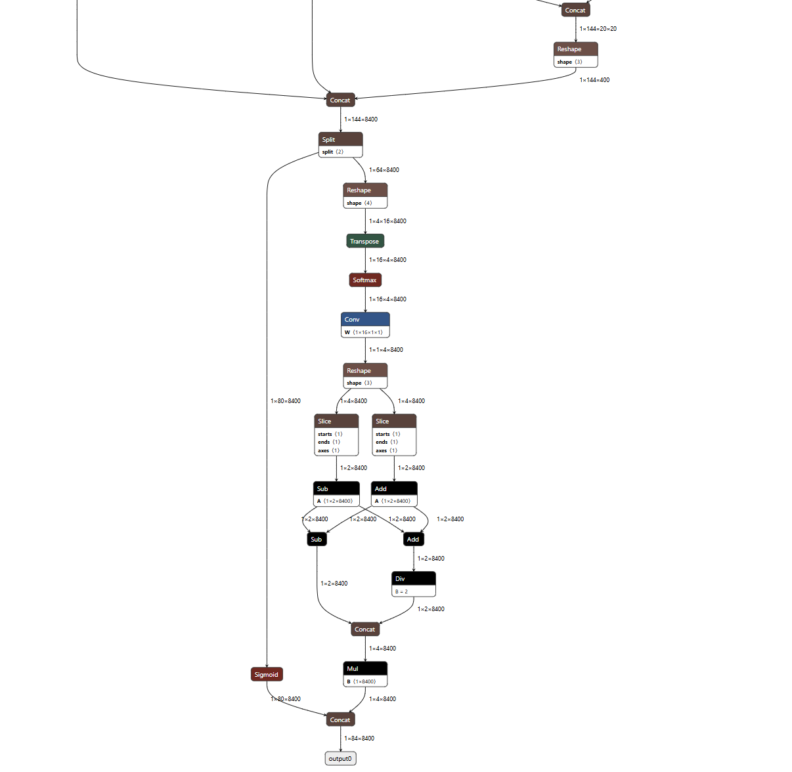
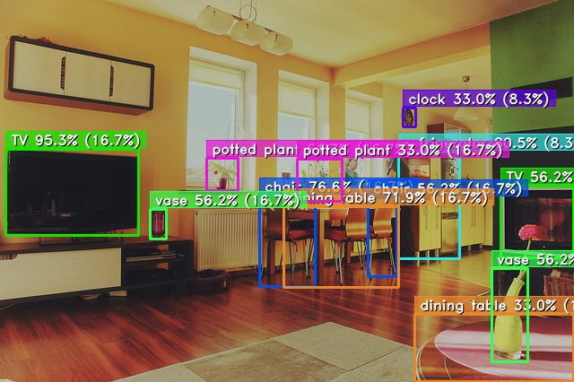
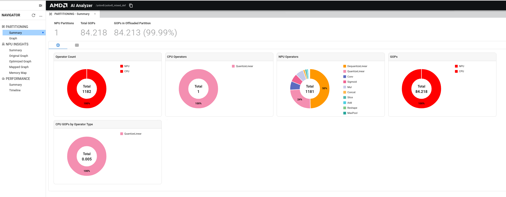
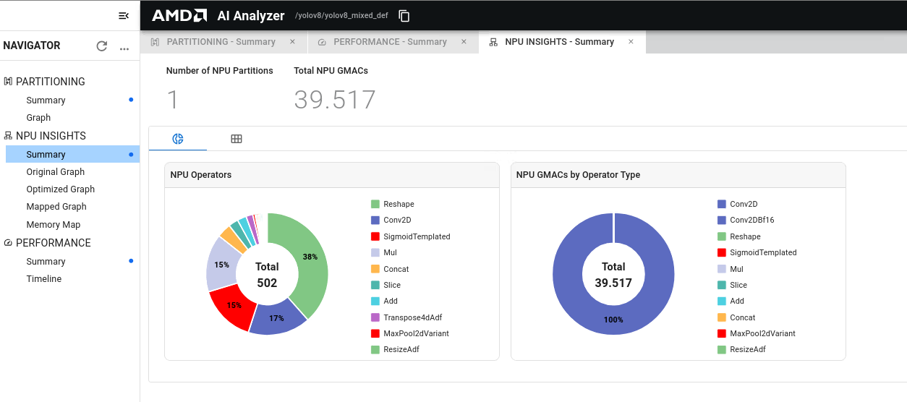
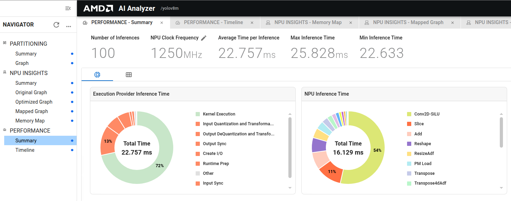
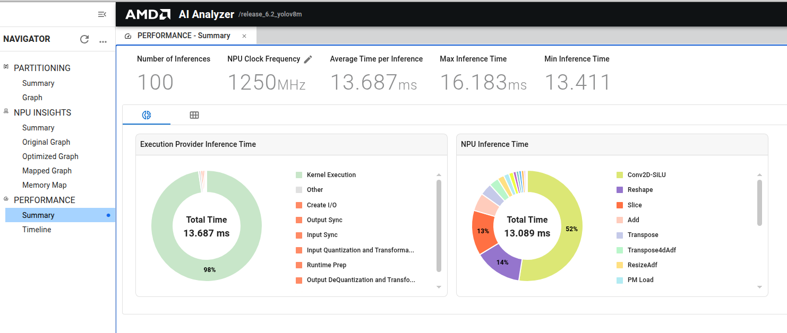

# YOLOv8m Object Detection: Quantization to Deployment

This tutorial outlines the essential steps for deploying the YOLOv8m model on AMD Versal AI Edge Series Gen 2 VEK385 Evaluation Kit
using Vitis AI 6.2, while leveraging the mixed-precision capabilities of the Vitis AI compiler.
The process begins with using AMD Quark to quantize the model into an INT8 format, employing the 
VINT8 configuration. During the compilation phase, the Vitis AI compiler automatically converts 
the FP32 tail section of the ONNX model to BF16. This conversion is crucial as it ensures that the 
entire model can effectively run on the NPU, thereby optimizing performance. The tutorial also covers 
latency optimization through optimization options in Vitis config file and analysis of NPU inference time.
Following these steps allows the model to be deployed efficiently, with inference being executed through the Vitis AI Execution Provider 
for ONNX Runtime, ensuring robust and seamless operation on the VEK385 evaluation kit.

## System Requirements

This tutorial requires:

* Vitis AI 6.2 Docker for Versal AI Edge Series Gen 2:
    * Instructions for installation and startup are in the Vitis AI User Guide for Versal AI Edge Series Gen 2.
* VEK385 evaluation kit (see above):
    * Setup instructions are available in the Vitis AI User Guide for Versal AI Edge Series Gen 2.
* Internet access:
    * Necessary for downloading resources.
    * Get the tutorial repository
* AIE-ML_v2 license file:
    * For license file, follow instructions in the Vitis AI User Guide for Versal AI Edge Series Gen 2.

## What You Will Accomplish

You will:

- Download YOLOv8m model from Ultralytics and export it to ONNX (Optset 17)
- Quantize the model to `VINT8` using AMD Quark Quantization API. 
- Compile and Run Inference on VEK385 NPU using AMD Vitis AI Execution Provider
- Acheive maximum operator offloading on VEK385 NPU 
- Analyse NPU Inference time for model performance
- Evaluate the model accuracy on VEK385-NPU
- Deploy compiled model and run end-to-end inference on the VEK385 NPU using Vitis AI Runtime (VART)


## Tutorial Workflow

### Prepare and Run Docker

Before starting Docker, adjust the access permissions of the working directories on the host machine:

```
chmod -R a+w <path/to/yolov8m>
```

Pull the docker image: 

```
docker pull amdih/vitis-ai:versal-2ve-release_v6.2_0612
```

Run `docker images` to verify docker REPOSITORY, IMAGEID and TAG information. 

|REPOSITORY          | TAG                            | IMAGE ID          | CREATED       | SIZE   |
|--------------------|--------------------------------|-------------------|---------------|--------|
|amdih/vitis-ai      |versal-2ve-release_v6.2_0612    |  8cd54102c274     |  xx hours ago | 31.2GB |

Start the docker: 

```
docker run -it --network host \  
  -v /path/to/your/license:/usr/licenses \  
  -v $PWD/yolov8m:/yolov8m \  
  --rm amdih/vitis-ai:versal-2ve-release_v6.2_0612 \
   "bash"
```

### Install Required Python Packages

Inside the docker, install the required python packages:

```bash
cd /yolov8m
python3 -m pip install --no-deps -r requirements.txt
```

**Note**: This tutorial uses Ultralytics version 8.3.225.

### Download and Export the Model

Use the provided Python script to download and export the model from Ultralytics. 
Inside docker: 

```bash
cd models
python3 export_to_onnx.py
```
This generates `yolov8m.onnx` inside `models/` directory. 

After the model is exported, calibration data is required for quantization and validation data is required for inference testing.

### Prepare Calibration Data for Quantization

Provide a folder containing PNG or JPG files for calibration. As a quick start, you can download images from [microsoft/onnxruntime-inference-examples](https://github.com/microsoft/onnxruntime-inference-examples/tree/main/quantization/image_classification/cpu/test_images). 

> **⚠️ Important**: This tutorial includes a pre-prepared calibration dataset for quantization. Since FP32 YOLOv8m model was trained on the COCO dataset, we provide a representative subset of COCO images for calibration in the ``calib_data`` folder.

Optionally, you can prepare large calibration dataset as well if you want to calibrate the model with larger dataset for more accuracy. 

Prepare data using below command, inside docker:

```bash
cd /yolov8m <inside repository> 
python3 prepare_data.py
ls datasets/coco/images/val2017/*.jpg | shuf -n 100 | xargs -I {} cp {} calib_data/
```
The script ``prepare_data.py`` downloads COCO validation images. For better calibration, you can use 100 images or 500 images. Note that larger calibration sets increase quantization time proportionally.

### Prepare Validation Data

This tutorial includes a test image in the ``val_data`` folder for validating object detection results.
Optionally, you can add your own test image or any image from COCO dataset. 

```bash
mkdir val_data
# Add test images for input
```

With the calibration and validation data prepared, the next step is to quantize the model to optimize it for NPU execution.

### Model Quantization

Quantization uses AMD Quark to optimize performance while preserving accuracy. For details, see https://quark.docs.amd.com/latest/

This tutorial quantizes the model for `VINT8` configuration. `VINT8` configuration uses symmetric INT8 activation with power-of-two scale. 

#### VINT8 Quantization

- The model is quantized using AMD Quark with `VINT8` configuration. AMD Quark provides default configurations that support INT8 quantization. 

General ``VINT8`` Quantization configuration example:

```
quant_config = get_default_config("VINT8")
quant_config.extra_options["Int32Bias"] = False
quant_config.extra_options["DedicatedQDQPair"]: True
quant_config.extra_options["QuantizeAllOpTypes"]: True
quant_config.enable_npu_cnn = True
float_model_path = "models/yolov8m.onnx"
quantized_model_path = "models/yolov8m_VINT8.onnx"
calib_data_path = "calib_data"
```

> **⚠️ Important**: When working with YOLOv8 models, you must exclude the post-processing subgraph from quantization. Using the general quantization strategy on the entire model will cause missed object detections. For YOLOv8 models, do not quantize the post-processing subgraph and apply ``VINT8`` quantization only to the main network to prevent detection failures. See below configuration example specific for YOLOv8 models: 

```
quant_config = get_default_config("VINT8")
quant_config.extra_options["Int32Bias"] = False
quant_config.extra_options["DedicatedQDQPair"]: True
quant_config.extra_options["QuantizeAllOpTypes"]: True
quant_config.enable_npu_cnn = True
quant_config.subgraphs_to_exclude = [(["/model.22/Concat_3"], ["/model.22/Concat_5"])]
float_model_path = "models/yolov8m.onnx"
quantized_model_path = "models/yolov8m_VINT8_skipNodes.onnx"
calib_data_path = "calib_data"
```

##### Modification 
YOLOv8 uses concat operations to combine confidence and bounding boxes as shown in below image. This leads to significant degradation in confidence values, missing most of the bounding boxes.


We need to skip the post-processing sub-graph to improve the accuracy of the VINT8 quantized model. Shown below in the post-processing sub-graph of yolov8m model.


The non-quantized post-processing sub-graphs ```"/model.22/Concat_3" and "/model.22/Concat_5"``` must be excluded from ``VINT8`` quantization. This avoids accuracy degradation or missed detections commonly observed with YOLOv ONNX models after full VINT8 quantization. 

Run quantization, inside docker:
```bash
python3 quantize.py
```
Example console summary: 

```
┏━━━━━━━━━┳━━━━━━━━━━━━┳━━━━━━━━━━┳━━━━━━━━━━┓
┃ Op Type ┃ Activation ┃ Weights  ┃ Bias     ┃
┡━━━━━━━━━╇━━━━━━━━━━━━╇━━━━━━━━━━╇━━━━━━━━━━┩
│ Conv    │ INT8(83)   │ INT8(83) │ INT8(83) │
│ Sigmoid │ INT8(77)   │          │          │
│ Mul     │ INT8(77)   │          │          │
│ Slice   │ INT8(16)   │          │          │
│ Add     │ INT8(12)   │          │          │
│ Concat  │ INT8(17)   │          │          │
│ MaxPool │ INT8(3)    │          │          │
│ Resize  │ INT8(2)    │          │          │
│ Reshape │ INT8(3)    │          │          │
└─────────┴────────────┴──────────┴──────────┘
```
The quantization excluding subgraphs generates ``models/yolov8m_VINT8_skipNodes.onnx`` model. 

After quantization finishes, compile the model. 

### Model Compilation
Compile the above VINT8 ONNX model ``models/yolov8m_VINT8_skipNodes.onnx`` for the NPU.

```bash
python3 compile.py
```

The compilation uses the following configuration:

```
provider_options_dict = {
        "config_file": "vitisai_config.json",
        "cache_dir": cache_dir_abs,
        "cache_key": args.cache_key,
        "ai_analyzer_visualization": True,
        "ai_analyzer_profiling": True,
        "target": "VAIML"
    }
    
    session = onnxruntime.InferenceSession(
        args.model_path,
        providers=["VitisAIExecutionProvider"],
        provider_options=[provider_options_dict]
    )
```
> **⚠️ Important**: The compiler converts the non-quantized post-processing subgraph from FP32 to BF16 and offloads it to the NPU, enabling mixed-precision execution.

For compilation summary, see `final-vaiml-pass-summary.txt` inside compiled `cache_dir/cache_key` folder. 
```
--------- Final Summary of VAIML Pass ----------
OS: Linux X64
VAIP commit: 82e73fd582c8c270490c80d52cd614683e52a7bc
Model: /yolov8_compile/models/yolov8m_VINT8_skipNodes.onnx
Model signature: 8af99e1407bdf6b1f6c788c045433855
Device: ve2
Model data type: float32 and int8 quantized
Device data type: bfloat16 and int8
Number of operators in the model: 1182
GOPs of the model: 84.2197
Number of operators supported by VAIML: 1181 (99.915%)
GOPs supported by VAIML: 84.215 (99.994%)
Number of subgraphs supported by VAIML: 1
Number of operators offloaded by VAIML: 1181 (99.915%)
GOPs offloaded by VAIML: 84.215 (99.994%)
Number of subgraphs offloaded by VAIML: 1
Number of subgraphs with compilation errors (fall back to CPU): 0
Number of subgraphs below 20% GOPs threshold (fall back to CPU): 0
Number of subgraphs above max number of subgraphs allowed(7): 0 (fall back to CPU)
Stats for offloaded subgraphs
Subgraph vaiml_par_0 stats: 
    Type: npu
    Operators: 1181 (99.915%)
    GOPs : 84.215 (99.994%)  OPs: 84,214,822,666
    int8 ops %: 93.846
    fp32 ops %: 0.001
```

### Inference 

Set up the VEK385 evaluation kit per Vitis AI User Guide for Versal AI Edge Series Gen 2. Copy the
compiled output cache dir, input folder/test image(s), Vitis AI config file and model folder(file) to the board server location.

> **📝 Note**: Before running inference, make sure ``cache_key/cache_dir``, ``vitisai_config.json`` and onnx model file is correctly passed in ``run_inference_.py`` script. 

Run inference on the VEK385 evaluation kit:

```bash
cd <working path>
python run_inference.py --model_path models/yolov8m_VINT8_skipNodes.onnx --cache_key yolov8m_VINT8_skipNodes  --output_dir output_VINT8 --image_path val_data/test_image.jpg
```
The ``run_inference.py`` involves three stages namely prepocessing of test input image, running inference on the VEK385 evaluation kit and postprocessing inference output for detections.

<details>
<summary><b>Preprocessing</b></summary>

Generate input NumPy arrays from validation images for VEK385 inference. This converts images to normalized float arrays and saves them per input.
With the preprocessed inputs prepared, the compiled model can now be deployed and run on the VEK385 evaluation kit for inference.

</details>

<details>
<summary><b>Inference on VEK385</b></summary>

Generate model inference output(s). 

</details>

<details>
<summary><b>Post-processing</b></summary>

Post-processing consumes the output from inference, applies Non-Maximum Suppression (NMS), and visualizes detections.

##### Non-Max Suppression (NMS)
* NMS removes redundant overlapping detections, keeping the most confident boxes. 
* Operates on model outputs loaded as tensors.
* Produces final per-image detections for visualization.

###### Parameters used in NMS 
``conf_thres = 0.05``
    Minimum confidence score for a detection to be considered

``iou_thres = 0.7``
    Intersection-over-Union threshold for suppressing overlapping boxes

``agnostic = False``
    Class agnostic NMS; when False, class aware suppression is performed

``max_det = 100``
    Maximum number of detections per image to keep after suppression

``classes = None``
    No filtering by specific classes; all classes are considered

</details>

After inference is completed, see visualization with detections (bounding boxes). Detections are saved in specified ``output_dir`` during inference. 


### Accuracy Evaluation on COCO Dataset

To quantify the performance of the quantized model, it is essential to evaluate model accuracy on the COCO dataset. This provides standardized metrics (mAP) to assess how well the quantized model performs relative to the original floating-point model.

> **📝 Note**: In the given evaluation table, the quantized model is calibrated using a subset of COCO images available in ``calib_data`` folder of the tutorial. For more accuracy insights, you can also run calibration with 100-500 COCO images as described in the [Prepare Calibration Data for Quantization](#prepare-calibration-data-for-quantization) section. 

Use ``evaluate.py`` script to run evaluation on 5k COCO dataset. The python script supports multiple device options for evaluation as follows: 

* ``cpu-fp32``: To evaluate original FP32 ONNX model on CPU using ``CPUExecutionProvider``

    ```bash
    python3 evaluate.py --model models/yolov8m.onnx --coco_dataset datasets/coco --device cpu-fp32
    ```

* ``cpu-int8-fp32``: To evaluate VINT8-FP32 quantized ONNX model on CPU using ``CPUExecutionProvider``

    ```bash
    python3 evaluate.py --model models/yolov8m_VINT8_skipNodes.onnx --coco_dataset datasets/coco --device cpu-int8-fp32
    ```

* ``npu-bf16``: To evaluate Vitis AI compiled BF16 model on VEK385 NPU using ``VitisAIExecutionProvider`` provided appropriate ``--cache_dir`` and ``--cache_key``

    ```bash
    python3 evaluate.py --model models/yolov8m.onnx --coco_dataset datasets/coco --device npu-bf16 --cache_key yolov8m_bf16
    ```

* ``npu-int8-bf16``: To evaluate Vitis AI compiled VINT8-BF16 model on VEK385 NPU using ``VitisAIExecutionProvider`` provided appropriate ``--cache_dir`` and ``--cache_key``

    ```bash
    python3 evaluate.py --model models/yolov8m_VINT8_skipNodes.onnx --coco_dataset datasets/coco --device npu-int8-bf16 --cache_key yolov8m_VINT8_skipNodes
    ```

<table>
<colgroup>
<col style="width: 14%">
<col style="width: 42%">
<col style="width: 15%">
<col style="width: 15%">
<col style="width: 14%">
</colgroup>
<thead>
<tr>
<th>YOLOv8m</th>
<th>Details</th>
<th>mAP (AP@[IoU=0.50:0.95])</th>
<th>mAP50 (AP@IoU=0.50)</th>
<th>mAP75 (AP@IoU=0.75)</th>
</tr>
</thead>
<tbody>
<tr>
<td>FP32 CPU</td>
<td>Original FP32 ONNX model, evaluation on CPU</td>
<td style="text-align: center">49.95</td>
<td style="text-align: center">67.02</td>
<td style="text-align: center">53.97</td>
</tr>
<tr>
<td>BF16 NPU</td>
<td>FP32 ONNX model compiled to BF16, evaluation on VEK385 NPU</td>
<td style="text-align: center">50.29</td>
<td style="text-align: center">67.66</td>
<td style="text-align: center">54.65</td>
</tr>
<tr>
<td>VINT8-FP32 CPU</td>
<td>FP32 model quantized to VINT8 with VINT8 head and FP32 tail, evaluation on CPU</td>
<td style="text-align: center">48.75</td>
<td style="text-align: center">66.28</td>
<td style="text-align: center">53.12</td>
</tr>
<tr>
<td>VINT8-BF16 NPU</td>
<td>VINT8-FP32 quantized model compiled to VINT8-BF16, evaluation on VEK385 NPU</td>
<td style="text-align: center">48.38</td>
<td style="text-align: center">66.12</td>
<td style="text-align: center">52.68</td>
</tr>
</tbody>
</table>         


Now, the upcoming section demonstrates how to enable AI Analyzer to better understand your VINT8-BF16 model deployment.

### AI Analyzer Insights 

During compilation and inference, AI Analyzer Profiling and Visualization must be enabled by passing additional provider options to the ONNXRuntime Inference Session. AI Analyzer can be used for analysis and visualization of model compilation and inference. In `run_inference.py`, pass ``ai_analyzer`` options as:

```
provider_options_dict = {
    "config_file": 'vitisai_config.json',
    "cache_dir":   'vek385_cache_dir',
    "cache_key":   'yolov8m_VINT8_skipNodes',
    "ai_analyzer_visualization": True,
    "ai_analyzer_profiling": True,
    "target": 'VAIML'
}

# NPU session
npu_session = ort.InferenceSession(
    quantized_vint8_model,
    sess_options,
    providers=["VitisAIExecutionProvider"],
    provider_options=[provider_options_dict]
) 
```
> **📝 Note**: Vitis config must have same AI analyzer options enabled to make sure Memory Map and Mapped Graph Summary is visible. 

The ``ai_analyzer_profiling`` flag enables generation of artifacts related to the inference profile. The ``ai_analyzer_visualization`` flag enables generation of artifacts related to graph partitions and operator fusion. These artifacts are generated as JSON files in the current run directory upon executing ``run_inference.py`` script. 

Once the JSON files are generated, launch AI Analyzer using steps below. 

- To launch AI analyzer using Vitis AI docker:
```
docker run -it -p 8011:8011 --network host \
  -v /path/to/your/license:/usr/licenses \
  -v $PWD/yolov8m:/yolov8m \
  --rm amdih/vitis-ai:versal-2ve-release_v6.2_0612 "bash"
```
- Inside docker:

```
aianalyzer <model execution path> --port 8011 --no-browser --bind 0.0.0.0
```
- After above step, there will be message like:
```
2025-12-17 06:02:39,809 INFO [client_id=n/a] 140172386235968 server.py:35 AI Analyzer 1.6.0.dev20251005221519+g1ea47349 serving on http://0.0.0.0:8011/dashboard?token=ZYkcJHumcLcVdqGsFKto4Ck7xQIo08I5BhbJMggHIY (Press CTRL+C to quit)
```
- In the host machine, start a browser and type the address from above message:
```
http://0.0.0.0:8011/dashboard?token=ZYkcJHumcLcVdqGsFKto4Ck7xQIo08I5BhbJMggHIY
```
AI Analyzer GUI looks like below:

The Partitioning Summary page provides an overview of how the model's operators have been assigned to Vitis CPU and NPU along with charts capturing GigaOp (GOP) offloading by operator type.



The NPU Summary page provides an overview of how the model was mapped to the AMD NPU. The Optimized Graph View can also be viewed, which shows the final model that is mapped to the NPU after all transformations and optimizations have been applied.



Similarly, the Performance Summary page can be explored, which displays several overall statistics for the inference(s), along with charts that break down operator runtime by operator. 
For details on launching AI Analyzer inside docker, see AI Analyzer section of Vitis AI Developer Guide for Versal AI Edge Series Gen 2.



### Using Vitis AI Runtime (VART)

As seen above, the total inference time using the ONNX Runtime Execution Provider is **24.441ms**. By switching to VART, this inference time can be reduced to **13.687 ms**. 
VART offloads computation directly to the NPU with minimal CPU involvement, delivering more efficient end-to-end performance compared to ONNX Runtime.

VART is a runtime environment designed for high-efficiency AI model inference on NPU hardware with minimal CPU overhead, and is used for precise end-to-end performance measurement.

The following steps outline the complete deployment workflow for running the compiled YOLOv8m model on the VEK385 NPU using VART.

**Model Compilation**

As shown in the [Model Compilation](#model-compilation) section, compile the quantized model using Vitis AI docker.

**Preprocess the Input**

Run the preprocessing script inside Docker to generate the `test_image_int8.bin` input file required for inference.

```bash
python preprocess_to_int8_bin.py --image_path val_data/test_image.jpg --output_dir input_vart
```

**Prepare ML VART configuration File**

The JSON file contains an object that describes the configuration for a single model inference session. Each session requires the model file, runner options, input feature map (IFM) configuration, and an output directory for output feature maps (OFMs).

```bash
{
  "inference-config": {
    "model-file": "yolov8m_VINT8_skipNodes",
    "runner-options": {
      "config-file": "vitisai_config.json",
      "log-level": "WARNING", 
      "ai-analyzer-profiling": true
    }
  },
  "ifms-config": [
    {
      "name": "images_QuantizeLinear_Output",
      "file": "input_vart/test_image_int8.bin"
    }
  ],
  "ofms-dir": "output_vart"
}
```

**Board Setup**

Follow the Vitis AI User Guide for Versal AI Edge Series Gen 2 to boot the VEK385 evaluation kit. Once the board has booted successfully, log in as the `amd-edf` user as described in the user guide.

**Copy Overlays**

Copy the overlay files provided as part of the AMD board package:

- Mount the host NFS export on the target:

```bash
sudo mount -t nfs 10.10.70.101:/exports/root /mnt
```

- Copy the overlay files into the target overlay directory:

```bash
sudo mkdir -p /overlay
sudo cp -r /mnt/overlay/* /overlay/
```

**Program PL + AI Engine Overlay**

Program the PL + AI Engine overlay PDI and DTB:

```bash
sudo fpgautil -b /overlay/vpl_gen_fixed_pld.pdi -o /overlay/pl_aiarm.dtbo
```

**Copy Configuration Files**

Copy the pre-processing configuration file and xclbin into the required directory:

```bash
sudo mkdir -p /run/media/mmcblk0p1/
sudo cp overlay/image_processing.cfg /run/media/mmcblk0p1/
sudo cp overlay/x_plus_ml.xclbin /run/media/mmcblk0p1/
```

**Preprocessed Input, Vitis Config, ML VART Config and Compiled Model Cache**

After completing the board setup, preprocessed binary input file(test_image_int8.bin), Vitis AI config file(vitisai_config.json), ML VART config json (ml_vart_config.json)  and the compiled model cache directory ( dir) to the target board. 

**Deployment on Board**

Before running the application on the board, configure the required environment variables:

```bash
echo 1 > /sys/module/rcupdate/parameters/rcu_cpu_stall_suppress
export XRT_AIARM=true
export LD_LIBRARY_PATH=/usr/lib/python3.12/site-packages/voe/lib/:/usr/lib/python3.12/site-packages/flexmlrt/lib/
export XLNX_ENABLE_CACHE=0
export XRT_ELF_FLOW=1
```

Run the application on the board:

```bash
ml_vart --app-config ml_vart_config.json
```

For 100 runs: 

```bash
ml_vart --app-config ml_vart_config.json --benchmark --runs 100
```

Expected console output:

```bash
Wrote tensor 0 data for frames 0-0 to file: "output_vart/infer_out0-bf16_1x84x8400_output0.bin"
Run completed successfully.
```

### AI Analyzer Output

After running inference using VART runtime, copy the inference output to the host machine where docker is launched. Now, open AI Analyzer inside the docker: 

```bash
aianalyzer /yolov8m --port 8011 --no-browser --bind 0.0.0.0
```



### Summary

This tutorial demonstrated the complete workflow for deploying YOLOv8m object detection on the VEK385 evaluation kit using Vitis AI:

1. **Model Preparation**: Downloaded and exported the YOLOv8m model from Ultralytics to ONNX format (Opset 17).

2. **Quantization**: Applied INT8 quantization with calibrated dataset using AMD Quark with VINT8 configuration to optimize the model for NPU execution while maintaining accuracy.

3. **Model Compilation**: Compiled the quantized ONNX model for the NPU to run on the VEK385 NPU.

4. **Deployment Pipeline**: Implemented a complete inference pipeline including preprocessing, inference on the VEK385 evaluation kit, and post-processing.

5. **Accuracy Optimization**: Identified and resolved accuracy degradation issues by excluding specific post-processing subgraphs (`/model.22/Concat_3` and `/model.22/Concat_5`) from quantization. 

6. **Validation**: Evaluated model accuracy on the COCO dataset across different configurations. 

## License

The MIT License (MIT)

Copyright (c) 2025 Advanced Micro Devices, Inc. All rights reserved.
